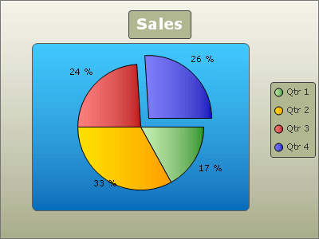

# Legend Display Mode

>caution  **RadChart** has been replaced by [RadHtmlChart](https://www.telerik.com/products/aspnet-ajax/html-chart.aspx), Telerik's client-side charting component. If you are considering **RadChart** for new development, examine the [RadHtmlChart documentation]() and [online demos](https://demos.telerik.com/aspnet-ajax/htmlchart/examples/overview/defaultcs.aspx) first to see if it will fit your development needs. If you are already using **RadChart** in your projects, you can migrate to **RadHtmlChart** by following these articles: [Migrating Series](), [Migrating Axes](), [Migrating Date Axes](), [Migrating Databinding](), [Features parity](). Support for **RadChart** is discontinued as of **Q3 2014**, but the control will remain in the assembly so it can still be used. We encourage you to use **RadHtmlChart** for new development.

**LegendDisplayMode** - this series.Appearance property will define what will be shown in the legend for each chart series. The valid values are from the ChartSeriesLegendDisplayMode enumeration.

* Nothing - the legend will not display information for this series

* SeriesName - the legend will display a single item for each series, this item will show the series name

* ItemLabels - the legend will display an item for each series item (the preferred setting for pie charts). Note, that although it is ItemLabels, the legend will actually display the value of the item Name property, thus providing means to show a different information from what is shown in the item labels.

Here is a pie chart with a single series with **LegendDisplayMode** set to "ItemLabels":

