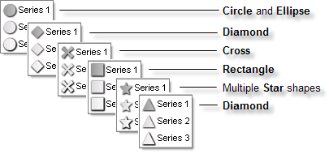
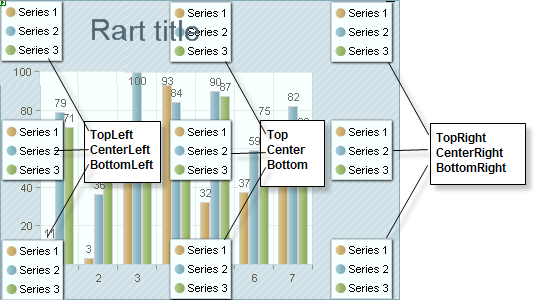
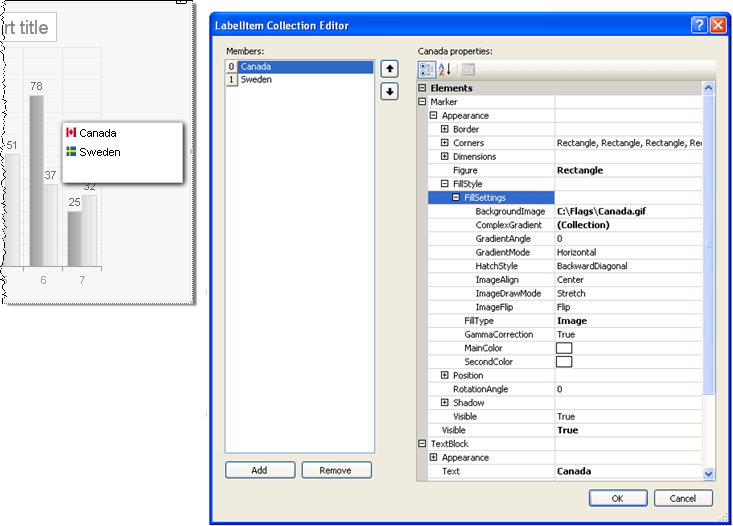

# Legends

>caution  **RadChart** has been replaced by[RadHtmlChart](http://www.telerik.com/products/aspnet-ajax/html-chart.aspx), Telerik's client-side charting component.	If you are considering **RadChart** for new development, examine the[RadHtmlChart documentation](ffd58685-7423-4c50-9554-f92c70a75138)and[online demos](http://demos.telerik.com/aspnet-ajax/htmlchart/examples/overview/defaultcs.aspx)first to see if it will fit your development needs.	If you are already using **RadChart** in your projects, you can migrate to **RadHtmlChart** by following these articles:[Migrating Series](2f393f28-bc31-459c-92aa-c3599785f6cc),[Migrating Axes](3f1bea81-87b9-4324-b0d2-d13131031048),[Migrating Date Axes](93226130-bc3c-4c53-862a-f9e17b2eb7dd),[Migrating Databinding](d6c5e2f1-280c-4fb0-b5b0-2f507697511d),[Feature parity](010dc716-ce38-480b-9157-572e0f140169).	Support for **RadChart** is discontinued as of **Q3 2014** , but the control will remain in the assembly so it can still be used.	We encourage you to use **RadHtmlChart** for new development.

Legends are symbols and text used to provide additional information about the chart.In a multiple series chart the legend typically describes each series to improve readability.By default RadChart includes the color and name of each chart series in the legend. You can also define your own legend and control the style for the legend or each item in the legend using the RadChart Legend property. Legend holds properties for:

* **Visible:** If a legend is not relevant to your chart you can set this false to hide the legend.

* **Appearance:** This property controls the visual style of the legend as a whole including **Dimensions**, **Position**, **FillStyle**, **ItemAppearance**, **ItemMarkerAppearance**, **ItemTextAppearance**, **RotationAngle** and **Shadow**.

* **Items**: A collection containing the individual legend text and symbols for each series.Add to this collection to create your own custom legends.

* **Marker**: A visual marker for the legend as a whole. Use the marker **Appearance** property to control properties like **FillStyle**, **Dimensions** and **Position.** To assign an image to the marker use the marker **Appearance.FillStyle** property to set **FillType** to **Image** and **FillSettings.BackgroundImage** to the path of the image.

* **TextBlock:** Use TextBlock to control the default text and appearance.

## Formatting Legends

Use the legend Appearance ItemTextAppearance property to tailor the look of all legend item text at one time and the ItemMarkerAppearance to format all of the legend markers.Particularly note the CompositionType property that handles the display order of text vs. images where valid values are **ColumnImageText**, **ColumnTextImage**, **RowImageText** (the default) and **RowTextImage**. "Column" values show the text and image one above the other."Row" shows text and image side-by-side.

Use the ItemMarkerAppearance Figure property to select from a set of predefined marker shapes.

Use the **Legend.Appearance.Position** property to control where the legend should appear on the chart surface. The AlignedPosition sub property automatically places the legend in a predefined position. Or set the Auto property false and manually set the X properties to place the legend in any exact position.

Use the **Legend.Appearance.Dimensions** property to control the legend height and width.By default the AutoSize sub property is true and dimensioning is handled for you.Set AutoSize off to manually handle Width, Height, Margins and Paddings.

## Adding Custom Legends

In the collection editor for the Legend **Items** property add one or more items. Use the **Marker** property to add images or colored shapes next to the text.Use the **TextBlock** property to add the text description for the legend item. You can also define image maps using the **ActiveRegion** property of the legend or legend items.

To add images to the legend you can set the Marker.Appearance.FillStyle.FillType to **Image** and the Marker.Appearance.FillStyle.FillSettings.BackgroundImage to the path of an image to display.In the example below two legend items are added to the collection where the BackgroundImage contains image paths for two flags and where the **TextBlock.Text** properties contain corresponding descriptions. In addition the Legend.Appearance.Shadow property has Blur = 5 and Distance = 2.

