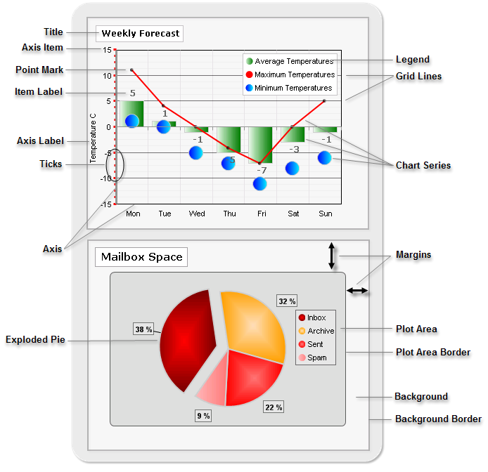

# Rad Chart Basics

>caution  **RadChart** has been replaced by[RadHtmlChart](http://www.telerik.com/products/aspnet-ajax/html-chart.aspx), Telerik's client-side charting component.	If you are considering **RadChart** for new development, examine the[RadHtmlChart documentation](ffd58685-7423-4c50-9554-f92c70a75138)and[online demos](http://demos.telerik.com/aspnet-ajax/htmlchart/examples/overview/defaultcs.aspx)first to see if it will fit your development needs.	If you are already using **RadChart** in your projects, you can migrate to **RadHtmlChart** by following these articles:[Migrating Series](2f393f28-bc31-459c-92aa-c3599785f6cc),[Migrating Axes](3f1bea81-87b9-4324-b0d2-d13131031048),[Migrating Date Axes](93226130-bc3c-4c53-862a-f9e17b2eb7dd),[Migrating Databinding](d6c5e2f1-280c-4fb0-b5b0-2f507697511d),[Feature parity](010dc716-ce38-480b-9157-572e0f140169).	Support for **RadChart** is discontinued as of **Q3 2014** , but the control will remain in the assembly so it can still be used.	We encourage you to use **RadHtmlChart** for new development.

Charts are composed of a hierarchy of elements. Most of the elements are common across all chart types (unless otherwise noted). The illustration below shows some of the significant chart elements.

## Chart Element Descriptions
|Element|Description|Element|Description|
| ------ | ------ | ------ | ------ |
|  **Title**  | The heading for the chart as a whole. The position and appearance of the title is completely customizable. [Read More]() |  **Legend**  | The legend contains a symbol and name for each series in the chart.The legend may also display a series of items. The position and appearance of the legend can also be customized. [Read more]() |
| **Axis Item** |Axis Items are the individual points along each axis that help indicate the axis measurement and scale. [Read more]()| **Grid Lines** |Vertical and horizontal lines parrallel to the X and Y axes.These grid lines form the grid, making the chart easier to read. [Read more]()|
| **Point Mark** |The point mark is a visual cue to enhance visibility of data points on line and area charts. [Read more]()[Series Items]()| **Chart Series** |Series contains a set of data points to be drawn on the chart. This set of points contains related data. Each series can be represented by a chart type. Pie charts use only a single series. For other chart types there is no limitation to the number of series or items within each series.[Read more]()|
| **Item Label** |The label next to each data point displaying a value or custom text. [Read more]()| **Margins** |The distance between the outer edge of an item to the outer edge of the item containing it.For example, the margin for the plot area is the distance from the plot area border to the outermost border of the chart. Plot area, legend and title all have margins. [Read More]()|
| **Axis Label** |The label next to each axis identifying the nature of data points found along that axis. [Read More]()| **Plot Area** |The area enclosed between the X and Y axes. [Read more]()|
| **Ticks** |Axis ticks are small marks that identify the position of items on the axes and the starting points of gridlines. [Read more]()| **Plot Area Border** |The line that encloses the area between the X and Y axes. [Read more]()|
| **Axis (X and Y)** |These axes form the coordinates in which the data points are placed. Chart series items are displayed along the X and Y axes. **Note** : Pie charts do not use axes. [Read more]()| **Background Border** |The outermost line that encloses the whole chart area. [Read more]()|
| **Exploded Pie** |A piece of the a Pie chart that is visually separated from the rest of the pie for easier distinction. [Read More]()|||

