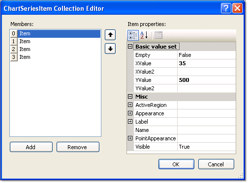

# Series Items

>caution  **RadChart** has been replaced by [RadHtmlChart](http://www.telerik.com/products/aspnet-ajax/html-chart.aspx), Telerik's client-side charting component. If you are considering **RadChart** for new development, examine the [RadHtmlChart documentation]() and [online demos](http://demos.telerik.com/aspnet-ajax/htmlchart/examples/overview/defaultcs.aspx) first to see if it will fit your development needs. If you are already using **RadChart** in your projects, you can migrate to **RadHtmlChart** by following these articles: [Migrating Series](), [Migrating Axes](), [Migrating Date Axes](), [Migrating Databinding](), [Features parity](). Support for **RadChart** is discontinued as of **Q3 2014**, but the control will remain in the assembly so it can still be used. We encourage you to use **RadHtmlChart** for new development.

Each chart series *item* encapsulates a single data point.

The key properties are shown in the figure below in the property category "Basic value set". For simple charts along a single axis populate the YValue property.Use the XValue property to add a second data dimension. For example, the Y values might be "Sales Volume" and the X values might be time periods or geographic regions.XValue2 and YValue2 are used by [Gantt]() type to indicate a period of time and the [Bubble]() chart type to show amplitude of data.

Set the Empty property to true to have RadChart approximate the value. The example below has a third item with the Empty property set to True, causing the item to display by default as a unfilled dotted line with a label of 30.5 (the average of the values that come before and after, 5 and 56, respectively). The look of the empty value is controlled by the EmptyValue property for the series Appearance.

Other significant properties for the ChartSeriesItemare:

* ActiveRegion: Contains HTML Attributes, ToolTip and URL. These properties support making image maps.

* Appearance: This contains common visual properties **Border**, **Corners**, **FillStyle** and **Visible**. In addition the property Exploded is specific to the [Pie]() chart property type. When true, Exploded displays a chart series item (a pie slice in this context) as slightly separated from the rest of the pie.

* Label: Use this property to override the default item label. By default the numeric values of each data point are displayed on the chart. Here you can use the Label.TextBlock.Text to add a more specific description of the data point. You have full control over each label HTML characteristics with the **Label.ActiveRegion**.Control visual display and layout using the Label.Appearance property.

