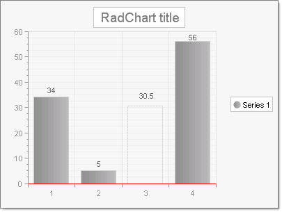

# Series Items

>caution  __RadChart__ has been replaced by[RadHtmlChart](http://www.telerik.com/products/aspnet-ajax/html-chart.aspx), Telerik's client-side charting component.	If you are considering __RadChart__ for new development, examine the[RadHtmlChart documentation](ffd58685-7423-4c50-9554-f92c70a75138)and[online demos](http://demos.telerik.com/aspnet-ajax/htmlchart/examples/overview/defaultcs.aspx)first to see if it will fit your development needs.	If you are already using __RadChart__ in your projects, you can migrate to __RadHtmlChart__ by following these articles:[Migrating Series](2f393f28-bc31-459c-92aa-c3599785f6cc),[Migrating Axes](3f1bea81-87b9-4324-b0d2-d13131031048),[Migrating Date Axes](93226130-bc3c-4c53-862a-f9e17b2eb7dd),[Migrating Databinding](d6c5e2f1-280c-4fb0-b5b0-2f507697511d),[Feature parity](010dc716-ce38-480b-9157-572e0f140169).	Support for __RadChart__ is discontinued as of __Q3 2014__ , but the control will remain in the assembly so it can still be used.	We encourage you to use __RadHtmlChart__ for new development.
>

## 

Each chart series *item* encapsulates a single data point.

The key properties are shown in the figure below in the property category "Basic value set". For simple charts along a single axis populate the YValue property.Use the XValue property to add a second data dimension. For example, the Y values might be "Sales Volume" and the X values might be time periods or geographic regions.XValue2 and YValue2 are used by [Gantt]() type to indicate a period of time and the [Bubble]() chart type to show amplitude of data.

Set the Empty property to true to have RadChart approximate the value. The example below has a third item with the Empty property set to True, causing the item to display by default as a unfilled dotted line with a label of 30.5 (the average of thevalues that come before and after, 5 and 56, respectively). The look of the empty value is controlled by the EmptyValue property for the series Appearance.
>caption 

Other significant properties for the ChartSeriesItemare:

* ActiveRegion: Contains HTML Attributes, ToolTip and URL. These properties support making image maps.

* Appearance: This contains common visual properties __Border__, __Corners__, __FillStyle__ and __Visible__.In addition the property Exploded is specific to the [Pie]() chart property type.When true, Exploded displays a chart series item (a pie slice in this context) as slightly separated from the rest of the pie.

* Label: Use this property to override the default item label.By default the numeric values of each data point are displayed on the chart.Here you can use the Label.TextBlock.Text to add a more specific description of the data point. You have full control over each label HTML characteristics with the __Label.ActiveRegion__.Control visual display and layout using the Label.Appearance property.
>caption 

