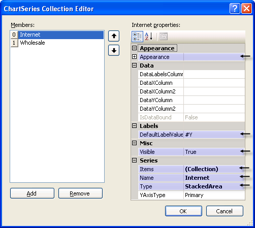

# Series Overview

>caution  **RadChart** has been replaced by[RadHtmlChart](http://www.telerik.com/products/aspnet-ajax/html-chart.aspx), Telerik's client-side charting component.	If you are considering **RadChart** for new development, examine the[RadHtmlChart documentation](ffd58685-7423-4c50-9554-f92c70a75138)and[online demos](http://demos.telerik.com/aspnet-ajax/htmlchart/examples/overview/defaultcs.aspx)first to see if it will fit your development needs.	If you are already using **RadChart** in your projects, you can migrate to **RadHtmlChart** by following these articles:[Migrating Series](2f393f28-bc31-459c-92aa-c3599785f6cc),[Migrating Axes](3f1bea81-87b9-4324-b0d2-d13131031048),[Migrating Date Axes](93226130-bc3c-4c53-862a-f9e17b2eb7dd),[Migrating Databinding](d6c5e2f1-280c-4fb0-b5b0-2f507697511d),[Feature parity](010dc716-ce38-480b-9157-572e0f140169).	Support for **RadChart** is discontinued as of **Q3 2014** , but the control will remain in the assembly so it can still be used.	We encourage you to use **RadHtmlChart** for new development.
>

## 

Series refers to a series of data points displayed in the chart. The RadChart Series object is a collection of [ChartSeriesItem]() objects.The number of series used depends on the type of chart.A Pie chart type only uses a single series. "Stacked" charts like the Stacked Area chart use several series.

Each ChartSeries object contains a collection of ChartSeriesItem objects that contain the actual data points displayed on the chart. You can [add data to a series programmatically]() at run time, at [design time in the Properties Window of Visual Studio](), [declaratively in the ASP.NET HTML markup](), or [by binding to a data source]().

Some key properties for the ChartSeries are:

* Appearance: This property contains the common appearance related properties such as Border, Corners, FillStyle and TextAppearance.In addition there are [series specific properties]() including LabelAppearance, LineSeriesAppearance, LegendDisplayMode, BubbleSize and PointMark.

* [DefaultLabelValue](): Specifies a format for label values.This allows you to display data points as numeric amounts, percentages, totals or any format described in this MSDN article [Standard Numeric Format Strings](http://msdn2.microsoft.com/en-us/library/dwhawy9k.aspx)

* [Items](): The collection of ChartSeriesItem objects that contain data points.

* Name: By default this name is displayed in the legend for the series.

* [Types](): Use this property to select the chart type.Valid values are [Bar](), [StackedBar](), [StackedBar100]({%slug chart/understanding-radchart-types/stacked-bar-100%-charts%}), [Line](), [Area](), [StackedArea](), [StackedArea100]({%slug chart/understanding-radchart-types/stacked-spline-area-100%-charts%}), [Pie](), [Gantt](), [Bezier](), [Spline](), [Bubble](), [Point](), [SplineArea](), [StackedSplineArea]() and [StackedSplineArea100]({%slug chart/understanding-radchart-types/stacked-spline-area-100%-charts%}).

* ] Visible: Turn this property off to hide the series.

>caption 

## ChartSeries Properties Used in Data Binding

DataLabelsColumn: This is the name of a data source column that will supply the text that displays next to each data point in the chart.DataXColumn, DataXColumn2, DataYColumn, DataYColumn2: These are the names of the columns that will contain data used for the series item XValue, XValue2, YValue and YValue2 columns respectively.
