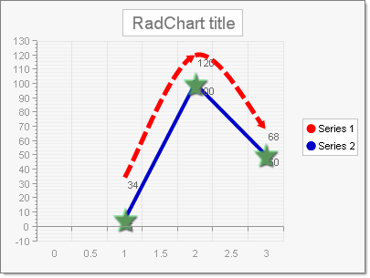
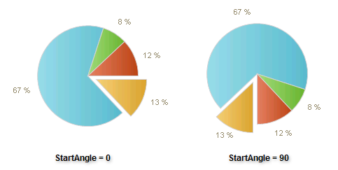
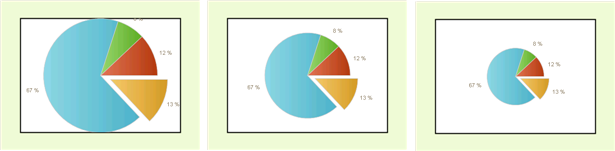
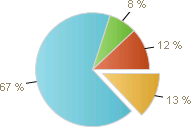
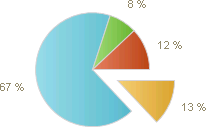

# Series-Specific Properties

>caution  **RadChart** has been replaced by [RadHtmlChart](http://www.telerik.com/products/aspnet-ajax/html-chart.aspx), Telerik's client-side charting component. If you are considering **RadChart** for new development, examine the [RadHtmlChart documentation]() and [online demos](http://demos.telerik.com/aspnet-ajax/htmlchart/examples/overview/defaultcs.aspx) first to see if it will fit your development needs. If you are already using **RadChart** in your projects, you can migrate to **RadHtmlChart** by following these articles: [Migrating Series](), [Migrating Axes](), [Migrating Date Axes](), [Migrating Databinding](), [Features parity](). Support for **RadChart** is discontinued as of **Q3 2014**, but the control will remain in the assembly so it can still be used. We encourage you to use **RadHtmlChart** for new development.

The following are properties specific to the series appearance of specific [chart types]().

## Bubble

The BubbleSize property is specific to the [Bubble]() chart type and allows you to increase or decrease bubble size without distorting the shape.

## Lines and Splines

The LineSeriesAppearance property is specific to the [Line]() and [Spline]() chart types.LineSeriesAppearance has a **Cap** property that governs the appearance of a line terminating shape that occurs where at each data point (except the first).Valid **Cap** values are **Flat**, **Square**, **Round**, **Triangle**, **NoAnchor**, **SquareAnchor**, **RoundAnchor**, **DiamondAnchor**, **ArrowAnchor**, **AnchorMask** and **Custom**. LineSeriesAppearance also has sub properties for **Color**, **PenStyle**, **Visible** and **Width**.

The PointMark is a shape that occurs at every data point, including the first.PointMarks are off by default but can be enabled using the Pointmark.Visible property. Use the Pointmark.Figure property to choose one of the predefined shapes. Other PointMark properties include **Border**, **Corners**, **Dimensions**, **FillStyle**, **RotationAngle** and **Shadow**.

The example above shows Series 1 in red where LineSeriesAppearance properties are:

* Cap = ArrowAnchor

* Color = Red

* PenStyle = Dash

* Width = 5

Series 2 show in blue has PointMark properties set as:

* Border.Color = 50, 0, 245, 100

* Border.Width = 1

*  Figure  = Star5

* Visible = True

* Dimensions.Height = 25px

* Dimensions.Width = 25px

* FillStyle.FillType = Solid

* FillStyle.MainColor = 90, 100, 254, 100

* Shadow.Blur = 1

* Shadow.Color = DimGray

* Shadow.Distance = 2

## Pie

The StartAngle property specifies degrees for the rotation of a pie. The default value and the starting position is 0°. Positive values of the StartAngle property will rotate the pie clockwise and negative - counterclockwise.

The DiameterScale property controls the ratio between the size of the plot area and the diameter of the chart. It effectively sets the size of the pie. In the example below, DiameterScale is set to 1, .75 (the default) and .5. 

When true, the ShowLabelConnectors property visually ties the label with the corresponding pie slice.

The ExplodePercent property defines the percentage of explosion of pie pieces. By default this is 20 percent.In the example below it is set to 50 percent:

The CenterXOffset and CenterYOffset properties specify the distance from the center of the plot area to the center of the pie in pixels. Use these two properties to position pie charts within the plot area.

