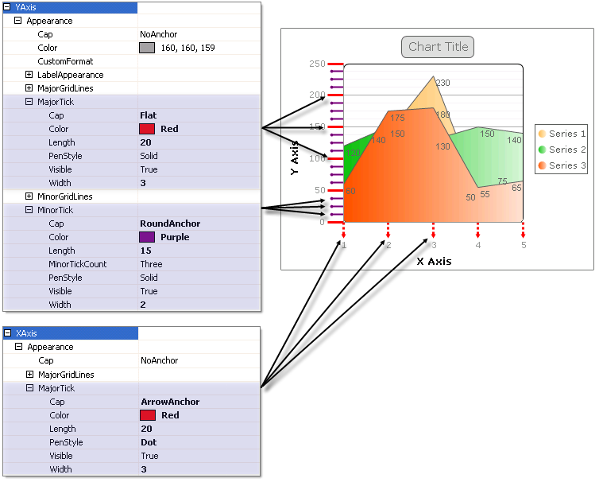
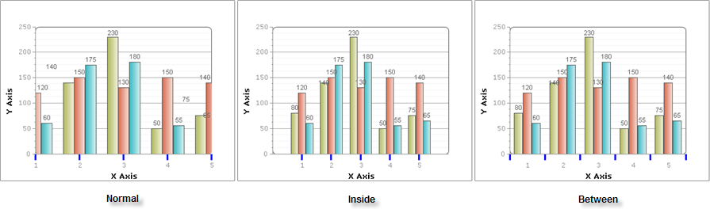

# Ticks

>caution  **RadChart** has been replaced by [RadHtmlChart](https://www.telerik.com/products/aspnet-ajax/html-chart.aspx), Telerik's client-side charting component. If you are considering **RadChart** for new development, examine the [RadHtmlChart documentation]() and [online demos](https://demos.telerik.com/aspnet-ajax/htmlchart/examples/overview/defaultcs.aspx) first to see if it will fit your development needs. If you are already using **RadChart** in your projects, you can migrate to **RadHtmlChart** by following these articles: [Migrating Series](), [Migrating Axes](), [Migrating Date Axes](), [Migrating Databinding](), [Features parity](). Support for **RadChart** is discontinued as of **Q3 2014**, but the control will remain in the assembly so it can still be used. We encourage you to use **RadHtmlChart** for new development.

Axis ticks are the small marks that identify the position of items on the axes and the starting points of gridlines.

Vertical ticks are controlled by the XAxis and horizontal ticks are controlled by YAxis and YAxis2. Ticks can be "major", e.g. falling on the labeled axis Step values. "Minor" ticks fall between Step values for YAxis and YAxis2. See the figure below where major ticks fall on 50, 100, 150, 200, 250 of the YAxis and minor ticks fall between the major ticks.

To control the visibility and general appearance of gridlines use the the PlotArea.<axis>.Appearance property to reach MajorTick and MinorTick properties.XAxis has only a MajorTick property while YAxis and YAxis2 have both MajorTick and MinorTick properties.Both major and minor tick objects include the following properties:

* Visible **:** Set this property false to hide the ticks.

* Cap **:** The terminator for each tick can be **Flat**, **Square**, **Round**, **Triangle**, **NoAnchor**, **SquareAnchor**, **DiamondAnchor**, **ArrowAnchor**, **AnchorMask** or **Custom**. In the example above the Y Axis major ticks have a **Square** cap, minor ticks have a **RoundCap** and X Axis major ticks have an **ArrowAnchor** cap.

* Color of the line and cap.

* Length: The length of the tick in pixels.To reverse the direction of the ticks and have them appear above the axis line use a negative value for Length.

* PenStyle: values can be **Solid**, **Dash**, **Dot**, **DashDot**, **DashDotDot** and **Custom**.

* Width in pixels.

## Layout

The LayoutModeproperty of each the X axis object specifies how axis marks are positioned with regard to series items. Layout modes change the chart appearance while the underlying data remains the same.. The available LayoutMode values are **Normal**, **Inside** and **Between**.

