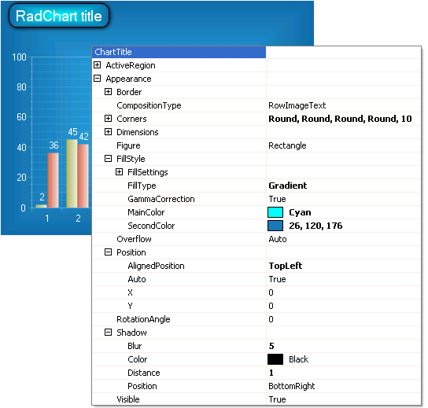

# Titles

>caution  **RadChart** has been replaced by [RadHtmlChart](https://www.telerik.com/products/aspnet-ajax/html-chart.aspx), Telerik's client-side charting component. If you are considering **RadChart** for new development, examine the [RadHtmlChart documentation]() and [online demos](https://demos.telerik.com/aspnet-ajax/htmlchart/examples/overview/defaultcs.aspx) first to see if it will fit your development needs. If you are already using **RadChart** in your projects, you can migrate to **RadHtmlChart** by following these articles: [Migrating Series](), [Migrating Axes](), [Migrating Date Axes](), [Migrating Databinding](), [Features parity](). Support for **RadChart** is discontinued as of **Q3 2014**, but the control will remain in the assembly so it can still be used. We encourage you to use **RadHtmlChart** for new development.

The title for the chart as a whole is controlled by the RadChart.ChartTitle object. The following sub properties of ChartTitle allow you to format the text, marker and overall appearance of the title:

* **ActiveRegion**: ActiveRegion contains properties for HTML **Attributes**, **Tooltip** and **URL.**

* **Appearance** controls visibility, **Border**, **Corners**, **Dimensions**, **FillStyle**, **Position**, **RotationAngle** and **Shadow** for the title. Use the Position.AlignedPosition to place the title area in a predefined position (e.g. **Left**, **Right**, **Center**, **Top**, **Bottom**, **BottomRight**, **BottomLeft**, **TopRight**, **TopLeft**), or set the Auto property off and use the X and Y properties to place the chart title anywhere on the chart including the plot area.

* **Marker** controls a small graphic for the title area. By default the marker is not visible.

* The **TextBlock** properties provides fine tune control over the text and text background.

In the example below the title is customized so that the position is aligned to the top left, corners are rounded, the fill is a gradient fill radiating from the center and a shadow makes it stand out from the background.

