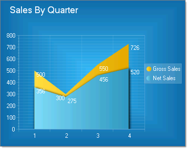
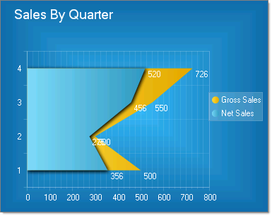

# Area Charts

>caution  **RadChart** has been replaced by [RadHtmlChart](https://www.telerik.com/products/aspnet-ajax/html-chart.aspx), Telerik's client-side charting component. If you are considering **RadChart** for new development, examine the [RadHtmlChart documentation]() and [online demos](https://demos.telerik.com/aspnet-ajax/htmlchart/examples/overview/defaultcs.aspx) first to see if it will fit your development needs. If you are already using **RadChart** in your projects, you can migrate to **RadHtmlChart** by following these articles: [Migrating Series](), [Migrating Axes](), [Migrating Date Axes](), [Migrating Databinding](), [Features parity](). Support for **RadChart** is discontinued as of **Q3 2014**, but the control will remain in the assembly so it can still be used. We encourage you to use **RadHtmlChart** for new development.

The Area chart consists of a series of data points joined by a line and where the area below the line is filled. Area charts are appropriate for visualizing data that fluctuates over a period of time and can be useful for emphasizing trends.Note: Values that don't vary too wildly work best for area charts.

Area charts display series in the order they are added, back-to-front.Depending on the Skin used, RadChart can automatically differentiate each series by displaying it in a different color. The appearance for each series can also be modified directly.

To create a Vertical Area Chart set the SeriesOrientation property to **Vertical**. Set the RadChart DefaultType property or ChartSeries.Type to **Area**.

To create a Horizontal Area Chart set the SeriesOrientation property to **Horizontal**. Set the RadChart DefaultType property or ChartSeries.Type to **Area**.

