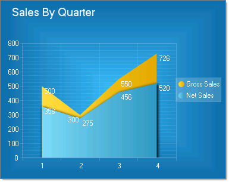
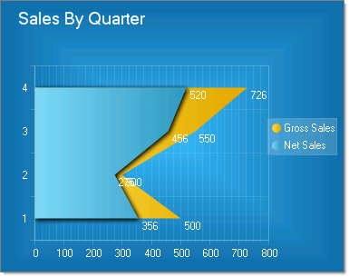

# Area Charts

>caution **RadChart** has been deprecated since Q3 2014 and is marked as obsolete as of the 2026 Q2 SP1 (v2026.2.708) release. This is the last release that includes the RadChart component — its source code will be removed from the assembly in the next release. We strongly recommend using [RadHtmlChart](https://www.telerik.com/products/aspnet-ajax/html-chart.aspx), Telerik's modern client-side charting component. 
>To transition from RadChart to RadHtmlChart, refer to the following migration articles:
> - [Migrating Series]()
> - [Migrating Axes]()
> - [Migrating Date Axes]()
> - [Migrating Databinding]()
> - [Features parity]()
>Explore the [RadHtmlChart documentation]() and online demos to determine how it fits your development needs.

The Area chart consists of a series of data points joined by a line and where the area below the line is filled. Area charts are appropriate for visualizing data that fluctuates over a period of time and can be useful for emphasizing trends.Note: Values that don't vary too wildly work best for area charts.

Area charts display series in the order they are added, back-to-front.Depending on the Skin used, RadChart can automatically differentiate each series by displaying it in a different color. The appearance for each series can also be modified directly.

To create a Vertical Area Chart set the SeriesOrientation property to **Vertical**. Set the RadChart DefaultType property or ChartSeries.Type to **Area**.

To create a Horizontal Area Chart set the SeriesOrientation property to **Horizontal**. Set the RadChart DefaultType property or ChartSeries.Type to **Area**.

