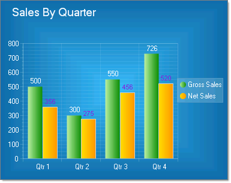
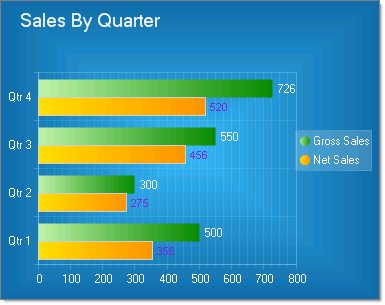

# Bar Charts

>caution  **RadChart** has been replaced by [RadHtmlChart](http://www.telerik.com/products/aspnet-ajax/html-chart.aspx), Telerik's client-side charting component. If you are considering **RadChart** for new development, examine the [RadHtmlChart documentation]() and [online demos](http://demos.telerik.com/aspnet-ajax/htmlchart/examples/overview/defaultcs.aspx) first to see if it will fit your development needs. If you are already using **RadChart** in your projects, you can migrate to **RadHtmlChart** by following these articles: [Migrating Series](), [Migrating Axes](), [Migrating Date Axes](), [Migrating Databinding](), [Features parity](). Support for **RadChart** is discontinued as of **Q3 2014**, but the control will remain in the assembly so it can still be used. We encourage you to use **RadHtmlChart** for new development.

Bar charts graphically summarize and display categories of data and let the user easily compare amounts or values between different categories. Bar charts are useful for comparing multiple series of data (i.e. providing snapshots of data at particular points in time).In the examples below the categories are various sources for sales (Internet, Wholesale, Retail) that combine to make the total sales for each quarter. RadChart automatically displays each series in a different color to make them easier to distinguish.

To create a Vertical Bar Chart set the SeriesOrientation property to **Vertical**. Set the RadChart DefaultType property or ChartSeries.Type to **Bar**.

To create a Horizontal Bar Chart set the SeriesOrientation property to **Horizontal**. Set the RadChart DefaultType property or ChartSeries.Type to **Bar**.

