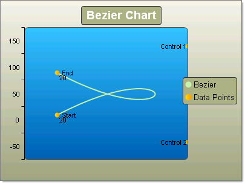
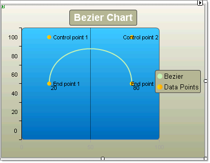
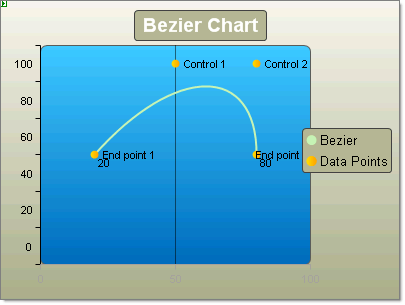

# Bezier Charts

>caution  **RadChart** has been replaced by [RadHtmlChart](https://www.telerik.com/products/aspnet-ajax/html-chart.aspx), Telerik's client-side charting component. If you are considering **RadChart** for new development, examine the [RadHtmlChart documentation]() and [online demos](https://demos.telerik.com/aspnet-ajax/htmlchart/examples/overview/defaultcs.aspx) first to see if it will fit your development needs. If you are already using **RadChart** in your projects, you can migrate to **RadHtmlChart** by following these articles: [Migrating Series](), [Migrating Axes](), [Migrating Date Axes](), [Migrating Databinding](), [Features parity](). Support for **RadChart** is discontinued as of **Q3 2014**, but the control will remain in the assembly so it can still be used. We encourage you to use **RadHtmlChart** for new development.

The Bezier chart is often used for modelling data by interpolating data points, through which curved lines pass.

To draw a Bezier chart series you add (1 + 3 x N) items to a series. So you can have 4 data points or 7, 10, 13, etc. The simplest set of data would be 4 data points: two end points and two "control points" that control the position and amount of curvature in the line between the two end points. See the figures below for examples. Each of the data points must have a X and Y value.

To create a simple vertical Bezier Chart set the SeriesOrientation property to **Vertical**. Set the RadChart DefaultType property or ChartSeries.Type to **Bezier**. Create a series and add four chart items with X and Y values.

>note The second chart series labeled "Data Points" is included to emphasize the location of the end and control points in the Bezier series.

To create a simple horizontal Bezier Chart set the SeriesOrientation property to **Horizontal**. Set the RadChart DefaultType property or ChartSeries.Type to **Bezier**. Create a series and add four chart items with X and Y values.

|  **YValue**  |  **XValue**  |
| ------ | ------ |
|20|50|
|20|100|
|80|100|
|80|50|

|  **YValue**  |  **XValue**  |
| ------ | ------ |
|20|50|
|50|100|
|80|100|
|80|50|

