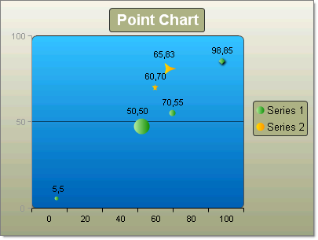
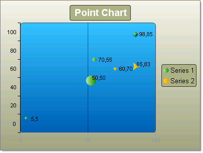

# Bubble Charts

>caution  **RadChart** has been replaced by [RadHtmlChart](https://www.telerik.com/products/aspnet-ajax/html-chart.aspx), Telerik's client-side charting component. If you are considering **RadChart** for new development, examine the [RadHtmlChart documentation]() and [online demos](https://demos.telerik.com/aspnet-ajax/htmlchart/examples/overview/defaultcs.aspx) first to see if it will fit your development needs. If you are already using **RadChart** in your projects, you can migrate to **RadHtmlChart** by following these articles: [Migrating Series](), [Migrating Axes](), [Migrating Date Axes](), [Migrating Databinding](), [Features parity](). Support for **RadChart** is discontinued as of **Q3 2014**, but the control will remain in the assembly so it can still be used. We encourage you to use **RadHtmlChart** for new development.

The Bubble chart is an extension of the Point chart but each point can be a circle or oval of any size or dimension. Instead of using just the XValue and YValue, the Bubble chart uses XValue/XValue2, and YValue/YValue2 pairs to define the dimensions of each bubble. Bubble charts are commonly used to display financial information where the size of the bubble can be proportionate to the data values.

>tip To change the size of all bubbles in a series, but to not distort the dimensions of the bubble, assign the Series.Appearance.BubbleSize property.

To create a vertical Bubble Chart set the SeriesOrientation property to **Vertical**. Set the RadChartDefaultType property or ChartSeries.Type **Bubble**. Add one or more chart series to the Series collection. Add one or more chart items to the series **Items** collection. Populate numeric values for XValue, XValue2, YValue and YValue2 properties of each chart series item.

To create a horizontal Bubble Chart set the SeriesOrientation property to **Horizontal**. Set the RadChart DefaultType property or ChartSeries.Type **Bubble**. Add one or more chart series to the Series collection. Add one or more chart items to the series Items collection. Populate numeric values for XValue, XValue2, YValue and YValue2 properties of each chart series item.

