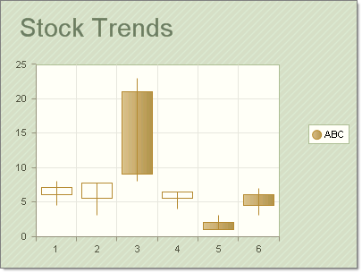
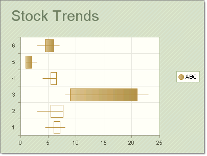

# CandleStick Charts

>caution  **RadChart** has been replaced by[RadHtmlChart](http://www.telerik.com/products/aspnet-ajax/html-chart.aspx), Telerik's client-side charting component.	If you are considering **RadChart** for new development, examine the[RadHtmlChart documentation](ffd58685-7423-4c50-9554-f92c70a75138)and[online demos](http://demos.telerik.com/aspnet-ajax/htmlchart/examples/overview/defaultcs.aspx)first to see if it will fit your development needs.	If you are already using **RadChart** in your projects, you can migrate to **RadHtmlChart** by following these articles:[Migrating Series](2f393f28-bc31-459c-92aa-c3599785f6cc),[Migrating Axes](3f1bea81-87b9-4324-b0d2-d13131031048),[Migrating Date Axes](93226130-bc3c-4c53-862a-f9e17b2eb7dd),[Migrating Databinding](d6c5e2f1-280c-4fb0-b5b0-2f507697511d),[Feature parity](010dc716-ce38-480b-9157-572e0f140169).	Support for **RadChart** is discontinued as of **Q3 2014** , but the control will remain in the assembly so it can still be used.	We encourage you to use **RadHtmlChart** for new development.

The [CandleStick chart](http://en.wikipedia.org/wiki/Candlestick_chart) combines bar and line chart styles to show a range of value movement over time. A filled bar indicates the opening value was greater than the closing value. An empty bar indicates that the closing value was greater than the opening value. The line through the center (the "wick") shows the extreme high and low values. The meaning of the Y values in a CandleStick chart are:

* YValue = Open

* YValue2 = Close

* YValue 3 = Max

* YValue 4 = Min

The "bar" portion of each chart item is formed between the YValue and YValue2 properties. The "wick" portion of the chart is defined with the YValue3 and YValue4 chart item properties.

To create a Vertical CandleStick Chart set the SeriesOrientationproperty to **Vertical**. Set the RadChart DefaultType property or ChartSeries.Type to **CandleStick**.

To create a Horizontal CandleStick Chart set the SeriesOrientationproperty to **Horizontal**. Set the RadChart DefaultType property or ChartSeries.Type to **CandleStick**.

The screenshots above use the following data points:

|  **YValue**  |  **YValue2**  |  **YValue3**  |  **YValue4**  |
| ------ | ------ | ------ | ------ |
|6|7.1|4.5|8|
|5.5|7.7|3|6|
|21|9|8|23|
|5.5|6.5|4|6.5|
|6|4.5|3|7|
|||||

