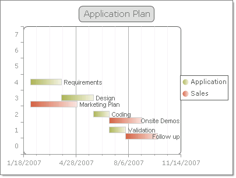
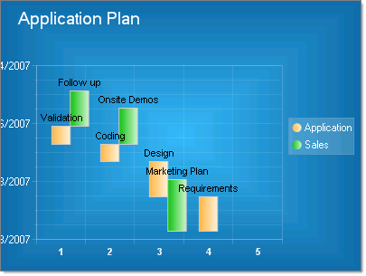

# Gantt Charts


>caution  __RadChart__ has been replaced by[RadHtmlChart](http://www.telerik.com/products/aspnet-ajax/html-chart.aspx), Telerik's client-side charting component.	If you are considering __RadChart__ for new development, examine the[RadHtmlChart documentation](ffd58685-7423-4c50-9554-f92c70a75138)and[online demos](http://demos.telerik.com/aspnet-ajax/htmlchart/examples/overview/defaultcs.aspx)first to see if it will fit your development needs.	If you are already using __RadChart__ in your projects, you can migrate to __RadHtmlChart__ by following these articles:[Migrating Series](2f393f28-bc31-459c-92aa-c3599785f6cc),[Migrating Axes](3f1bea81-87b9-4324-b0d2-d13131031048),[Migrating Date Axes](93226130-bc3c-4c53-862a-f9e17b2eb7dd),[Migrating Databinding](d6c5e2f1-280c-4fb0-b5b0-2f507697511d),[Feature parity](010dc716-ce38-480b-9157-572e0f140169).	Support for __RadChart__ is discontinued as of __Q3 2014__ , but the control will remain in the assembly so it can still be used.	We encourage you to use __RadHtmlChart__ for new development.
>


## 

Gantt charts help visualize time based information. Gantt charts, also known as Time charts, display separate events, with a beginning and an end. These charts are often used for project/time planning, where data can be plotted using a date-time scale or a numerical scale.

To create a vertical Gantt Chart set the SeriesOrientation property to __Vertical__. Set the RadChart DefaultType property or ChartSeries.Type to Gantt.
>caption 



To create a horizontal Gantt Chart set the SeriesOrientation property to __Horizontal__. Set the RadChart DefaultType property or ChartSeries.Type to Gantt.
>caption 




Other Gantt chart issues:

* To add dates to an axis or chart item, values must be converted to OleAutomation types.Use the [DateTime.](http://msdn2.microsoft.com/en-us/library/system.datetime.aspx)[ToOADate()](http://msdn2.microsoft.com/en-us/library/system.datetime.tooadate.aspx) function for this purpose.

* When setting a range for an axis that involves dates, set the axis IsZeroBased property to zero.This avoids having the range calculated from the minimum date value forward, instead of a range you define.

* Use the ValueFormat property to display values as dates.

>tabbedCode

````C#
	     
							RadChart1.PlotArea.YAxis.Appearance.ValueFormat =Telerik.Charting.Styles.ChartValueFormat.ShortDate;
				
````
````VB.NET
	     
							RadChart1.PlotArea.YAxis.Appearance.ValueFormat = Telerik.Charting.Styles.ChartValueFormat.ShortDate
				
````
>end
