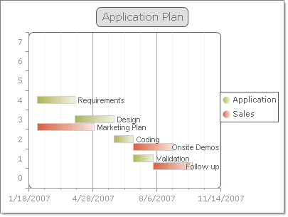
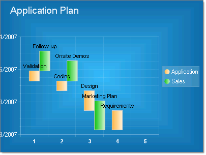

# Gantt Charts

>caution **RadChart** has been deprecated since Q3 2014 and is marked as obsolete as of the 2026 Q2 SP1 (v2026.2.708) release. This is the last release that includes the RadChart component — its source code will be removed from the assembly in the next release. We strongly recommend using [RadHtmlChart](https://www.telerik.com/products/aspnet-ajax/html-chart.aspx), Telerik's modern client-side charting component. 
>To transition from RadChart to RadHtmlChart, refer to the following migration articles:
> - [Migrating Series]()
> - [Migrating Axes]()
> - [Migrating Date Axes]()
> - [Migrating Databinding]()
> - [Features parity]()
>Explore the [RadHtmlChart documentation]() and online demos to determine how it fits your development needs.

Gantt charts help visualize time based information. Gantt charts, also known as Time charts, display separate events, with a beginning and an end. These charts are often used for project/time planning, where data can be plotted using a date-time scale or a numerical scale.

To create a vertical Gantt Chart set the SeriesOrientation property to **Vertical**. Set the RadChart DefaultType property or ChartSeries.Type to Gantt.



To create a horizontal Gantt Chart set the SeriesOrientation property to **Horizontal**. Set the RadChart DefaultType property or ChartSeries.Type to Gantt.



Other Gantt chart issues:

* To add dates to an axis or chart item, values must be converted to OleAutomation types.Use the [DateTime.](https://msdn2.microsoft.com/en-us/library/system.datetime.aspx)[ToOADate()](https://msdn2.microsoft.com/en-us/library/system.datetime.tooadate.aspx) function for this purpose.

* When setting a range for an axis that involves dates, set the axis IsZeroBased property to zero.This avoids having the range calculated from the minimum date value forward, instead of a range you define.

* Use the ValueFormat property to display values as dates.

````C#
RadChart1.PlotArea.YAxis.Appearance.ValueFormat = Telerik.Charting.Styles.ChartValueFormat.ShortDate;
````
````VB
RadChart1.PlotArea.YAxis.Appearance.ValueFormat = Telerik.Charting.Styles.ChartValueFormat.ShortDate
````

