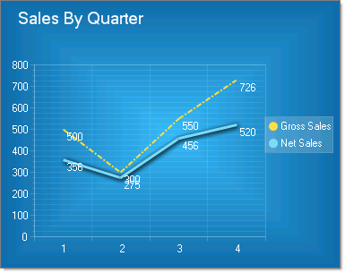
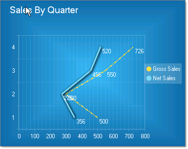

# Line Charts

>caution **RadChart** has been deprecated since Q3 2014 and is no longer recommended for use, as it does not support modern browsers. We strongly recommend using [RadHtmlChart](https://www.telerik.com/products/aspnet-ajax/html-chart.aspx), Telerik's modern client-side charting component. 
>To transition from RadChart to RadHtmlChart, refer to the following migration articles:
> - [Migrating Series]()
> - [Migrating Axes]()
> - [Migrating Date Axes]()
> - [Migrating Databinding]()
> - [Features parity]()
>Explore the [RadHtmlChart documentation]() and online demos to determine how it fits your development needs.

Line charts are used to display a series of data points, typically to show trends over a period of time. One or more series of data can be used and the appearance for each series can be tailored to emphasize the data using unique colors, line thicknesses, shadow, pen style, and point marks.

To create a Vertical Line Chart set the SeriesOrientation property to **Vertical**. Set the RadChart DefaultType property or ChartSeries.Type to **Line**.

To create a Horizontal Line Chart set the SeriesOrientation property to **Horizontal**. Set the RadChart DefaultType property or ChartSeries.Type to **Line**.

