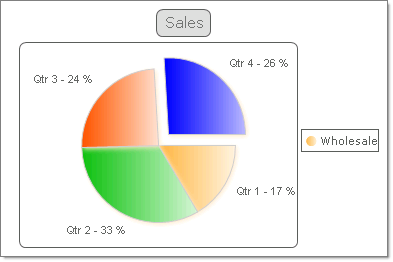
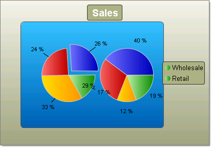

# Pie Charts

>caution  **RadChart** has been replaced by[RadHtmlChart](http://www.telerik.com/products/aspnet-ajax/html-chart.aspx), Telerik's client-side charting component.	If you are considering **RadChart** for new development, examine the[RadHtmlChart documentation](ffd58685-7423-4c50-9554-f92c70a75138)and[online demos](http://demos.telerik.com/aspnet-ajax/htmlchart/examples/overview/defaultcs.aspx)first to see if it will fit your development needs.	If you are already using **RadChart** in your projects, you can migrate to **RadHtmlChart** by following these articles:[Migrating Series](2f393f28-bc31-459c-92aa-c3599785f6cc),[Migrating Axes](3f1bea81-87b9-4324-b0d2-d13131031048),[Migrating Date Axes](93226130-bc3c-4c53-862a-f9e17b2eb7dd),[Migrating Databinding](d6c5e2f1-280c-4fb0-b5b0-2f507697511d),[Feature parity](010dc716-ce38-480b-9157-572e0f140169).	Support for **RadChart** is discontinued as of **Q3 2014** , but the control will remain in the assembly so it can still be used.	We encourage you to use **RadHtmlChart** for new development.
>

## 

Pie charts are used to display the contribution of fractional parts to a whole. A Pie chart uses a single series of data.Multiple series of data can be defined and are each displayed in a separate pie chart.

You can tailor the look of each pie slice individually by working with the pie chart series Appearance property:

* You can "explode" (i.e. offset) a single slice of the pie to emphasize a portion of the data by setting the pie chart series item Appearance.ExplodedSeries property to true.

* The Appearance.FillStyle FillSettings property allows you to set the fill for each slice to Solid, Gradient, ComplexGradient, Hatch or Image. You also have control over gradients (colors, direction and angle), images (alignment, orientation), colors and shadows.

* Control the label format and appearance for each slice using the pie chart series item Label property.The **Label.TextBlock.Text** can make use of built-in formats, such as "#Y" to show the values for the Y axis or "#%" to show the percentage value of a slice.The figure below uses a format similar to "Qtr 1 - #%".

* You can chnage the size of the Pie by the **DiameterScale** property. The property accepts values between **0** and **1** and as it's name says it specifies the Diameter of the Pie. The closer to 1 the values is - the bigger the Pie's Diameter becomes.

To create a Pie chart set the RadChart DefaultType property or ChartSeries.Type **Pie**.

>caption 

>caption 

