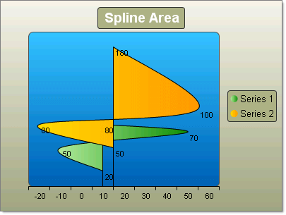
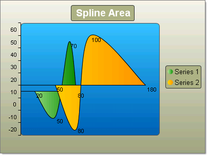

# Spline Area Charts

>caution **RadChart** has been deprecated since Q3 2014 and is marked as obsolete as of the 2026 Q2 SP1 (v2026.2.708) release. This is the last release that includes the RadChart component — its source code will be removed from the assembly in the next release. We strongly recommend using [RadHtmlChart](https://www.telerik.com/products/aspnet-ajax/html-chart.aspx), Telerik's modern client-side charting component. 
>To transition from RadChart to RadHtmlChart, refer to the following migration articles:
> - [Migrating Series]()
> - [Migrating Axes]()
> - [Migrating Date Axes]()
> - [Migrating Databinding]()
> - [Features parity]()
>Explore the [RadHtmlChart documentation]() and online demos to determine how it fits your development needs.

Spline charts allow you to take a limited set of known data points and approximate intervening values. In the Spline Area Chart the area defined by the spline curve is filled. In practice you define a series of chart items and RadChart does the rest. Each series overlays the preceding, from back to front.

To create a simple vertical Spline Area Chart set the SeriesOrientation property to **Vertical**. Set the RadChart DefaultType property or ChartSeries.Type to **SplineArea**. Create one or more series and add chart items with Y or X and Y values.

To create a simple horizontal Spline Area Chart set the SeriesOrientation property to **Horizontal**. Set the RadChart DefaultType property or ChartSeries.Type to **SplineArea**. Create a series and add chart items with Y or X and Y values.

