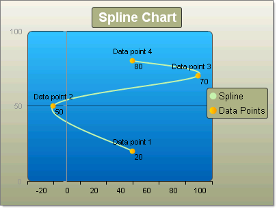
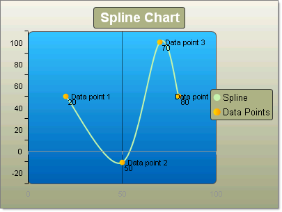

# Spline Charts

>caution  **RadChart** has been replaced by [RadHtmlChart](http://www.telerik.com/products/aspnet-ajax/html-chart.aspx), Telerik's client-side charting component. If you are considering **RadChart** for new development, examine the [RadHtmlChart documentation]() and [online demos](http://demos.telerik.com/aspnet-ajax/htmlchart/examples/overview/defaultcs.aspx) first to see if it will fit your development needs. If you are already using **RadChart** in your projects, you can migrate to **RadHtmlChart** by following these articles: [Migrating Series](), [Migrating Axes](), [Migrating Date Axes](), [Migrating Databinding](), [Features parity](). Support for **RadChart** is discontinued as of **Q3 2014**, but the control will remain in the assembly so it can still be used. We encourage you to use **RadHtmlChart** for new development.

Spline charts allow you to take a limited set of known data points and approximate intervening values. In practice you define a series of chart items with X/Y values and RadChart does the rest.

To create a simple vertical Spline Chart set the SeriesOrientation property to **Vertical**. Set the RadChart DefaultType property or ChartSeries.Type to **Spline**. Create a series and add chart items with Y or X and Y values.

To create a simple horizontal Spline Chart set the SeriesOrientation property to **Horizontal**. Set the RadChart DefaultType property or ChartSeries.Type to **Spline**. Create a series and add 3 or more chart items with X and Y values.

|  **YValue**  |  **XValue**  |
| ------ | ------ |
|20|50|
|50|-10|
|70|100|
|80|50|

Another example showing the same Y data points as above, but with no X values defined displays an automatic even progression over the X axis.

|  **YValue**  |
| ------ |
|20|
|50|
|70|
|80|

