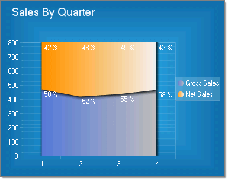
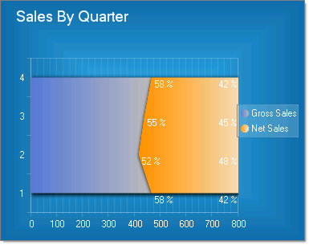

# Stacked Area 100% Charts

>caution **RadChart** has been deprecated since Q3 2014 and is marked as obsolete as of the 2026 Q2 SP1 (v2026.2.708) release. This is the last release that includes the RadChart component — its source code will be removed from the assembly in the next release. We strongly recommend using [RadHtmlChart](https://www.telerik.com/products/aspnet-ajax/html-chart.aspx), Telerik's modern client-side charting component. 
>To transition from RadChart to RadHtmlChart, refer to the following migration articles:
> - [Migrating Series]()
> - [Migrating Axes]()
> - [Migrating Date Axes]()
> - [Migrating Databinding]()
> - [Features parity]()
>Explore the [RadHtmlChart documentation]() and online demos to determine how it fits your development needs.

Stacked Areas 100% charts are a variation of Stacked Area charts that present values for trends as percentages, totaling to 100% for each category

To create a Vertical Stacked Area 100% Chart set the SeriesOrientationproperty to **Vertical**. Set the RadChart DefaultType property or ChartSeries.Type to **StackedArea100**.

To create a Horizontal Stacked Area 100% Chart set the SeriesOrientationproperty to **Horizontal**. Set the RadChart DefaultType property or ChartSeries.Type to **StackedArea100**.

>tip To display the label values as percentages, change the DefaultLabelValue for each chart series from "#Y" (the numeric value for each data point) to "#%" (the percentage of each data point to the category).

