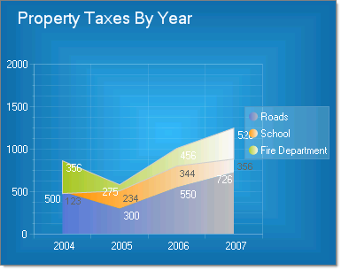
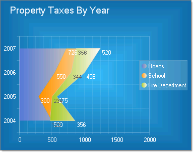

# Stacked Area Charts

>caution  __RadChart__ has been replaced by[RadHtmlChart](http://www.telerik.com/products/aspnet-ajax/html-chart.aspx), Telerik's client-side charting component.	If you are considering __RadChart__ for new development, examine the[RadHtmlChart documentation](ffd58685-7423-4c50-9554-f92c70a75138)and[online demos](http://demos.telerik.com/aspnet-ajax/htmlchart/examples/overview/defaultcs.aspx)first to see if it will fit your development needs.	If you are already using __RadChart__ in your projects, you can migrate to __RadHtmlChart__ by following these articles:[Migrating Series](2f393f28-bc31-459c-92aa-c3599785f6cc),[Migrating Axes](3f1bea81-87b9-4324-b0d2-d13131031048),[Migrating Date Axes](93226130-bc3c-4c53-862a-f9e17b2eb7dd),[Migrating Databinding](d6c5e2f1-280c-4fb0-b5b0-2f507697511d),[Feature parity](010dc716-ce38-480b-9157-572e0f140169).	Support for __RadChart__ is discontinued as of __Q3 2014__ , but the control will remain in the assembly so it can still be used.	We encourage you to use __RadHtmlChart__ for new development.
>

## 

The Stacked Area chart is a variation of the Area chart that display trends of the contribution of each value over time (or across categories). The areas are stacked so that each series adjoins but does not overlap the preceding series.This contrasts with the Area chart where each series overlays the preceding series.

Depending on the Skin used, RadChart can automatically differentiate each series by displaying it in a different color. The appearance for each series can also be modified directly.

To create a Vertical Stacked Area Chart set the SeriesOrientation property to __Vertical__. Set the RadChart DefaultType property or ChartSeries.Type to __StackedArea__.

>caption 

To create a Horizontal Stacked Area Chart set the SeriesOrientation property to __Horizontal__. Set the RadChart DefaultType property or ChartSeries.Type to __Area__.

>caption 

