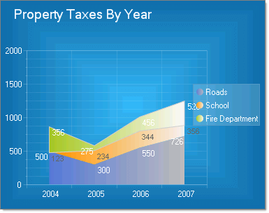
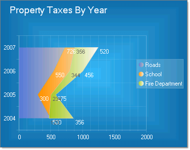

# Stacked Area Charts

>caution **RadChart** has been deprecated since Q3 2014 and is marked as obsolete as of the 2026 Q2 SP1 (v2026.2.708) release. This is the last release that includes the RadChart component — its source code will be removed from the assembly in the next release. We strongly recommend using [RadHtmlChart](https://www.telerik.com/products/aspnet-ajax/html-chart.aspx), Telerik's modern client-side charting component. 
>To transition from RadChart to RadHtmlChart, refer to the following migration articles:
> - [Migrating Series]()
> - [Migrating Axes]()
> - [Migrating Date Axes]()
> - [Migrating Databinding]()
> - [Features parity]()
>Explore the [RadHtmlChart documentation]() and online demos to determine how it fits your development needs.

The Stacked Area chart is a variation of the Area chart that display trends of the contribution of each value over time (or across categories). The areas are stacked so that each series adjoins but does not overlap the preceding series. This contrasts with the Area chart where each series overlays the preceding series.

Depending on the Skin used, RadChart can automatically differentiate each series by displaying it in a different color. The appearance for each series can also be modified directly.

To create a Vertical Stacked Area Chart set the SeriesOrientation property to **Vertical**. Set the RadChart DefaultType property or ChartSeries.Type to **StackedArea**.

To create a Horizontal Stacked Area Chart set the SeriesOrientation property to **Horizontal**. Set the RadChart DefaultType property or ChartSeries.Type to **Area**.

