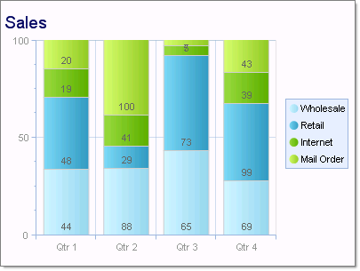
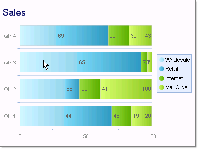

# Stacked Bar 100% Charts

>caution  **RadChart** has been replaced by [RadHtmlChart](https://www.telerik.com/products/aspnet-ajax/html-chart.aspx), Telerik's client-side charting component. If you are considering **RadChart** for new development, examine the [RadHtmlChart documentation]() and [online demos](https://demos.telerik.com/aspnet-ajax/htmlchart/examples/overview/defaultcs.aspx) first to see if it will fit your development needs. If you are already using **RadChart** in your projects, you can migrate to **RadHtmlChart** by following these articles: [Migrating Series](), [Migrating Axes](), [Migrating Date Axes](), [Migrating Databinding](), [Features parity](). Support for **RadChart** is discontinued as of **Q3 2014**, but the control will remain in the assembly so it can still be used. We encourage you to use **RadHtmlChart** for new development.

Stacked Bar 100 charts are used when you have three or more data series and want to compare distributions within categories, and at the same time display the differences between categories. Each bar represents 100% of the amounts for that category.

To create a Vertical Stacked Bar 100 Chart set the SeriesOrientation property to **Vertical**. Set the RadChart DefaultType property or ChartSeries.Type to **StackedBar100**.

To create a Horizontal Stacked Bar Chart set the SeriesOrientation property to **Horizontal**. Set the RadChart DefaultType property or ChartSeries.Type to **StackedBar100**.

>tip To display the label values as percentages, change the DefaultLabelValue for each chart series from "#Y" (the numeric value for each data point) to "#%" (the percentage of each data point to the category).

