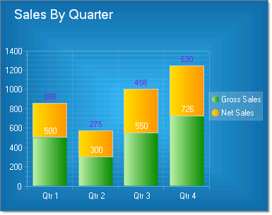
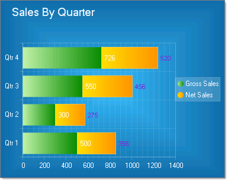

# Stacked Bar Charts

>caution  **RadChart** has been replaced by[RadHtmlChart](http://www.telerik.com/products/aspnet-ajax/html-chart.aspx), Telerik's client-side charting component.	If you are considering **RadChart** for new development, examine the[RadHtmlChart documentation](ffd58685-7423-4c50-9554-f92c70a75138)and[online demos](http://demos.telerik.com/aspnet-ajax/htmlchart/examples/overview/defaultcs.aspx)first to see if it will fit your development needs.	If you are already using **RadChart** in your projects, you can migrate to **RadHtmlChart** by following these articles:[Migrating Series](2f393f28-bc31-459c-92aa-c3599785f6cc),[Migrating Axes](3f1bea81-87b9-4324-b0d2-d13131031048),[Migrating Date Axes](93226130-bc3c-4c53-862a-f9e17b2eb7dd),[Migrating Databinding](d6c5e2f1-280c-4fb0-b5b0-2f507697511d),[Feature parity](010dc716-ce38-480b-9157-572e0f140169).	Support for **RadChart** is discontinued as of **Q3 2014** , but the control will remain in the assembly so it can still be used.	We encourage you to use **RadHtmlChart** for new development.

Stacked bar charts are used to compare contributions of values to a total across categories. In the examples below the categories are various sources for sales (Internet, Wholesale, Retail) that combine to make the total sales for each quarter. Use the Stacked Bar chart when you need visibility to the combined values for each category.

To create a Vertical Stacked Bar Chart set the SeriesOrientation property to **Vertical**. Set the RadChartDefaultType property or ChartSeries.Type to **StackedBar**.

To create a Horizontal Stacked Bar Chart set the SeriesOrientation property to **Horizontal**. Set the RadChartDefaultType property or ChartSeries.Type to **StackedBar**.

>tip To display custom labelling on the X-Axis "Qtr 1", "Qtr 2", etc., set the RadChart PlotArea.XAxis property and for each item set the TextBlock **Text** property to the desired label.

