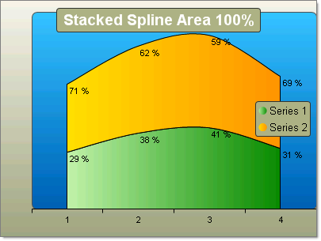

# Stacked Spline Area 100% Charts

>caution  **RadChart** has been replaced by[RadHtmlChart](http://www.telerik.com/products/aspnet-ajax/html-chart.aspx), Telerik's client-side charting component.	If you are considering **RadChart** for new development, examine the[RadHtmlChart documentation](ffd58685-7423-4c50-9554-f92c70a75138)and[online demos](http://demos.telerik.com/aspnet-ajax/htmlchart/examples/overview/defaultcs.aspx)first to see if it will fit your development needs.	If you are already using **RadChart** in your projects, you can migrate to **RadHtmlChart** by following these articles:[Migrating Series](2f393f28-bc31-459c-92aa-c3599785f6cc),[Migrating Axes](3f1bea81-87b9-4324-b0d2-d13131031048),[Migrating Date Axes](93226130-bc3c-4c53-862a-f9e17b2eb7dd),[Migrating Databinding](d6c5e2f1-280c-4fb0-b5b0-2f507697511d),[Feature parity](010dc716-ce38-480b-9157-572e0f140169).	Support for **RadChart** is discontinued as of **Q3 2014** , but the control will remain in the assembly so it can still be used.	We encourage you to use **RadHtmlChart** for new development.
>

## 

The Stacked Spline Area 100% chart is a variation of the Spline Area chart. The areas are stacked so that each series adjoins but does not overlap the preceding series. This chart displays contributions for each data point to the category as a percentage.

To create a vertical Stacked Spline Area Chart 100% chart, set the SeriesOrientation property to **Vertical**. Set the RadChart DefaultType property or ChartSeries.Type to **StackedSplineArea100**.

To create a horizontal Stacked Spline Area Chart 100% chart, set the SeriesOrientation property to **Horizontal**. Set the RadChart DefaultType property or ChartSeries.Type to **StackedSplineArea100**.

>caption 

>tip To display the label values as percentages, change the DefaultLabelValue for each chart series from "#Y" (the numeric value for each data point) to "#%" (the percentage of each data point to the category).
>

