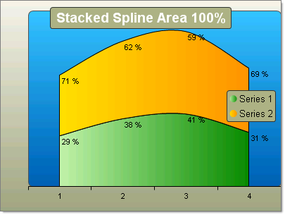

# Stacked Spline Area 100% Charts

>caution **RadChart** has been deprecated since Q3 2014 and is no longer recommended for use, as it does not support modern browsers. We strongly recommend using [RadHtmlChart](https://www.telerik.com/products/aspnet-ajax/html-chart.aspx), Telerik's modern client-side charting component. 
>To transition from RadChart to RadHtmlChart, refer to the following migration articles:
> - [Migrating Series]()
> - [Migrating Axes]()
> - [Migrating Date Axes]()
> - [Migrating Databinding]()
> - [Features parity]()
>Explore the [RadHtmlChart documentation]() and online demos to determine how it fits your development needs.

The Stacked Spline Area 100% chart is a variation of the Spline Area chart. The areas are stacked so that each series adjoins but does not overlap the preceding series. This chart displays contributions for each data point to the category as a percentage.

To create a vertical Stacked Spline Area Chart 100% chart, set the SeriesOrientation property to **Vertical**. Set the RadChart DefaultType property or ChartSeries.Type to **StackedSplineArea100**.

To create a horizontal Stacked Spline Area Chart 100% chart, set the SeriesOrientation property to **Horizontal**. Set the RadChart DefaultType property or ChartSeries.Type to **StackedSplineArea100**.

>tip To display the label values as percentages, change the DefaultLabelValue for each chart series from "#Y" (the numeric value for each data point) to "#%" (the percentage of each data point to the category).

