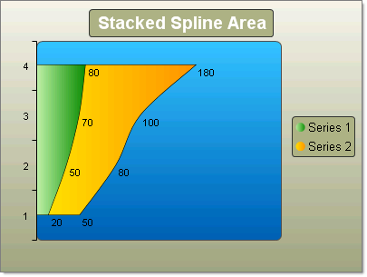

# Stacked Spline Area Charts

>caution  **RadChart** has been replaced by [RadHtmlChart](http://www.telerik.com/products/aspnet-ajax/html-chart.aspx), Telerik's client-side charting component. If you are considering **RadChart** for new development, examine the [RadHtmlChart documentation]() and [online demos](http://demos.telerik.com/aspnet-ajax/htmlchart/examples/overview/defaultcs.aspx) first to see if it will fit your development needs. If you are already using **RadChart** in your projects, you can migrate to **RadHtmlChart** by following these articles: [Migrating Series](), [Migrating Axes](), [Migrating Date Axes](), [Migrating Databinding](), [Features parity](). Support for **RadChart** is discontinued as of **Q3 2014**, but the control will remain in the assembly so it can still be used. We encourage you to use **RadHtmlChart** for new development.

The Stacked Spline Area chart is a variation of the Spline Area chart. The areas are stacked so that each series adjoins but does not overlap the preceding series. This contrasts with the Stacked Area chart where each series overlays the preceding series.

To create a simple vertical Stacked Spline Area Chart set the SeriesOrientation property to **Vertical**. Set the RadChart DefaultType property or ChartSeries.Type to **StackedSplineArea**. Create multiple chart series and add chart items with Y or X and Y values

To create a simple horizontal Stacked Spline Area Chart set the SeriesOrientation property to **Horizontal**. Set the RadChart DefaultType property or ChartSeries.Type to **StackedSplineArea**. Create multiple chart series and add chart items with Y or X and Y values

