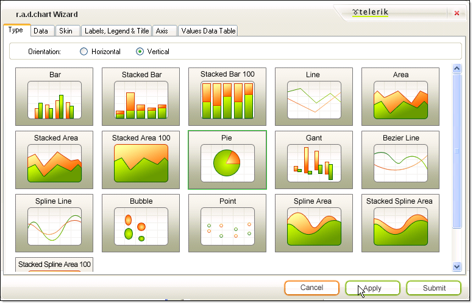

# RadChart Wizard

>caution  **RadChart** has been replaced by [RadHtmlChart](https://www.telerik.com/products/aspnet-ajax/html-chart.aspx), Telerik's client-side charting component. If you are considering **RadChart** for new development, examine the [RadHtmlChart documentation]() and [online demos](https://demos.telerik.com/aspnet-ajax/htmlchart/examples/overview/defaultcs.aspx) first to see if it will fit your development needs. If you are already using **RadChart** in your projects, you can migrate to **RadHtmlChart** by following these articles: [Migrating Series](), [Migrating Axes](), [Migrating Date Axes](), [Migrating Databinding](), [Features parity](). Support for **RadChart** is discontinued as of **Q3 2014**, but the control will remain in the assembly so it can still be used. We encourage you to use **RadHtmlChart** for new development.

The RadChart Wizard helps you traverse the many properties of RadChart by providing the most commonly used properties in an intuitive way. The wizard can help you quickly set up the basic structure of your chart. You can invoke the chart wizard from the RadChart [Smart Tag](), from the context menu that appears when you right-click RadChart and from the link at the bottom of the properties window.

The RadChart Interface consists of tabs:

* [Type]()

* [Data]()

* [Skin]()

* [Labels, Legend & Title]()

* [Axis]()

* [Values Data Table]()

