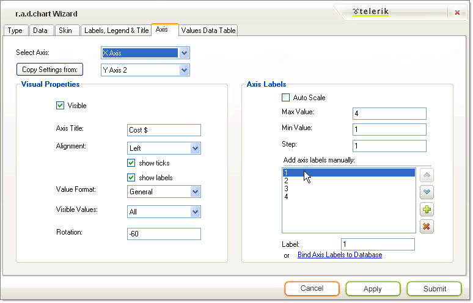
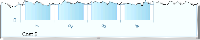

# The Wizard Axis Tab

>caution  __RadChart__ has been replaced by[RadHtmlChart](http://www.telerik.com/products/aspnet-ajax/html-chart.aspx), Telerik's client-side charting component.	If you are considering __RadChart__ for new development, examine the[RadHtmlChart documentation](ffd58685-7423-4c50-9554-f92c70a75138)and[online demos](http://demos.telerik.com/aspnet-ajax/htmlchart/examples/overview/defaultcs.aspx)first to see if it will fit your development needs.	If you are already using __RadChart__ in your projects, you can migrate to __RadHtmlChart__ by following these articles:[Migrating Series](2f393f28-bc31-459c-92aa-c3599785f6cc),[Migrating Axes](3f1bea81-87b9-4324-b0d2-d13131031048),[Migrating Date Axes](93226130-bc3c-4c53-862a-f9e17b2eb7dd),[Migrating Databinding](d6c5e2f1-280c-4fb0-b5b0-2f507697511d),[Feature parity](010dc716-ce38-480b-9157-572e0f140169).	Support for __RadChart__ is discontinued as of __Q3 2014__ , but the control will remain in the assembly so it can still be used.	We encourage you to use __RadHtmlChart__ for new development.
>

The __Axis__ tab lets you select an axis from the drop down list at the top of the page.You can then modify the properties below and they will be retained for the selected axis.Use the __Copy Settings From__ button to replicate settings from another axis.

## Visual Properties

The __Visual Properties__ section of the page controls properties for the axis as a whole.

* Uncheck the __Visible__checkbox to hide the entire axis (including labels and tick marks).

* __Axis Title__text populates a single label that appears for the axis as a whole.

* Use the __Alignment__ property to place the axis label in a predefined position, e.g. Left, Right, Top, Bottom, Center, TopRight, TopLeft, BottomRight, BottomLeft.

* Uncheck __Show Ticks__ to hide the [axis tick marks]().

* Uncheck __Show Labels__ to hide the axis labels (but not the Axis Title).

* The __Value Format__drop down list automatically formats axis labels as various kinds of dates, times, percentages, numbers and currency.

* __Visible Values__ can be All, Positive or Negative values.

* __Rotation__is used to rotate the axis label text. Positive numbers spin the labels clockwise, negative numbers counter-clockwise.

## Axis Labels

* Turn off __Auto Scale__if you want to provide custom axis labels instead of the default numeric values. Turning off Auto Scale also lets you use the __Min__, __Max__and __Step__values.

* Enter __Min__and __Max__values to control the number of series items to be displayed along that axis. Enter a __Step__value to control the interval between axis labels.

* If Auto Scale is off you can use the provided list box to add, delete and reorder axis label items manually. By selecting any one of the axis label values in the listbox you can assign a text label.

* Click the __Bind Axis Labels to Database__ link to navigate back to the [Data tab]().
>caption 

The settings in the Axis Tab shown above result in the following X Axis labeling example:
>caption 

