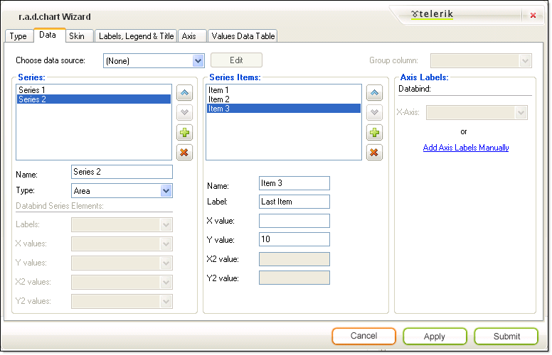
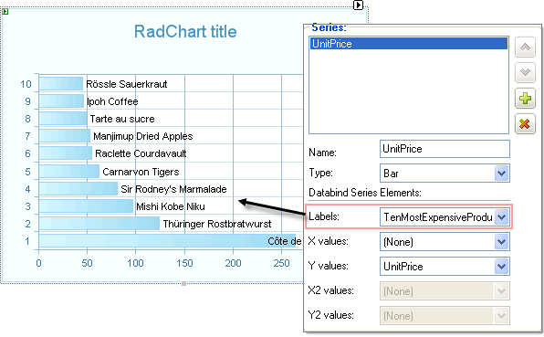
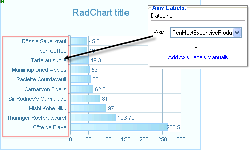

# The Wizard Data Tab

>caution  **RadChart** has been replaced by[RadHtmlChart](http://www.telerik.com/products/aspnet-ajax/html-chart.aspx), Telerik's client-side charting component.	If you are considering **RadChart** for new development, examine the[RadHtmlChart documentation](ffd58685-7423-4c50-9554-f92c70a75138)and[online demos](http://demos.telerik.com/aspnet-ajax/htmlchart/examples/overview/defaultcs.aspx)first to see if it will fit your development needs.	If you are already using **RadChart** in your projects, you can migrate to **RadHtmlChart** by following these articles:[Migrating Series](2f393f28-bc31-459c-92aa-c3599785f6cc),[Migrating Axes](3f1bea81-87b9-4324-b0d2-d13131031048),[Migrating Date Axes](93226130-bc3c-4c53-862a-f9e17b2eb7dd),[Migrating Databinding](d6c5e2f1-280c-4fb0-b5b0-2f507697511d),[Feature parity](010dc716-ce38-480b-9157-572e0f140169).	Support for **RadChart** is discontinued as of **Q3 2014** , but the control will remain in the assembly so it can still be used.	We encourage you to use **RadHtmlChart** for new development.

The **Data** tab brings together the Series, Series Item, Axis labels and data binding to a single screen. Here you can add data points to your chart manually or by binding to data sources.

The **Data** tab is composed of areas:

## Choose Data Source

**Choose Data Source** appears on the upper left hand portion of the screen. Select from an existing data source or select "<new data source" from the drop down list. If you have an existing data source selected, click the **Edit** button to reconfigure the data source in the **Configure Data Source Wizard**.

## Group Column

**Group Column** appears on the upper right side. Select a column name from a bound data source to group by that column data.

## Series

Use the **Series** area of the tab to add, delete and reorder chart series elements using the list box provided. Use the plus and minus buttons to add or delete a series element. Use the up and down arrows to move a series element up or down in the list. For each selected series element in the list box you can provide a name and select from the [list of chart types]().

If you bind to a data source the **Databind Series Elements** portion will be enabled and allow you to choose column names for your labels and values from the drop down lists provided. When you bind to a data source the **Series** list box will be populated automatically with a series for each numeric column in the data source. If you need to fine tune the behavior or appearance of a series in more depth than the **Data** tab provides, use the RadChart [Series]() property in the property window. In the example below the **Labels** for the series have been bound to a column "TenMostExpensiveProducts", which contains product descriptions. These descriptions display to the right next to each bar in the chart. Note that [SeriesOrientation]() is Horizontal, so the X-Axis is on the left.

## Series Items

For each series you select in the **Series** area list, you can add, edit, delete and reorder entries in the **Series Items** list. Use the plus and minus buttons to add and delete series items. Use the up and down arrows to move series items up or down in the list. For each item you can set the **Name**, **Label** and **X** and **Y** Values. X2 and Y2 values are enabled for [Gantt]() and [Bubble]() chart types. If you need to refine the behavior or appearance in more detail than provided by this Wizard page, use the Items collection of the RadChart[Series]() from the Property window.

## Axis Labels

This section lets you choose between binding to a column in the data source and using the column data to populate the labels along an Axis. Click the **Add Labels Manually** link to navigate to the [Axis tab](). The screen shot below shows the X-Axis labels set data bound to a column "TenMostExpensiveProducts" that contains product descriptions. Note that [SeriesOrientation]() is Horizontal, so the X-Axis items show on the left.

