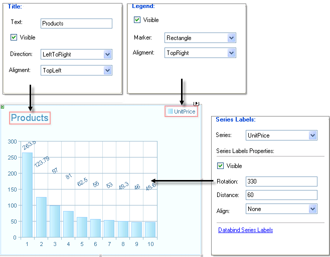

# The Wizard Labels, Legend and Titles Tab

>caution  **RadChart** has been replaced by [RadHtmlChart](http://www.telerik.com/products/aspnet-ajax/html-chart.aspx), Telerik's client-side charting component. If you are considering **RadChart** for new development, examine the [RadHtmlChart documentation]() and [online demos](http://demos.telerik.com/aspnet-ajax/htmlchart/examples/overview/defaultcs.aspx) first to see if it will fit your development needs. If you are already using **RadChart** in your projects, you can migrate to **RadHtmlChart** by following these articles: [Migrating Series](), [Migrating Axes](), [Migrating Date Axes](), [Migrating Databinding](), [Features parity](). Support for **RadChart** is discontinued as of **Q3 2014**, but the control will remain in the assembly so it can still be used. We encourage you to use **RadHtmlChart** for new development.

On the **Labels, Legend and Titles** Tab:

* **Title:** From this portion of the tab set the **Text** for the title, toggle visibility of the title using the checkbox provided and set text direction from the drop down list. Use the **Alignment** drop down to move the title position between None, Left, Top, Bottom, Center, TopRight, TopLeft, BottomRight and BottomLeft.

* **Legend:** Unselect the Visible checkbox to hide the legend. Use the **Marker** drop down to select from a predefined list of shapes. In the example below the Rectangle shape is selected. Use the **Alignment** drop down to move the legend position between None, Left, Top, Bottom, Center, TopRight, TopLeft, BottomRight and BottomLeft. In the example below the legend is moved to the upper right corner.

>tip If you hide the legend, the extra space at the right of the screen remains. Use the PlotArea.Appearance.Dimensions.Margins to add or remove buffer space around the [plot area]().

* **Series Labels**: This section lets you set label properties for a series name selected in the Series drop down list. Uncheck the **Visible** box to hide the series labels.Enter a value between 0 and 360 to the **Rotation** entry to rotate all series labels at one time.In the example below the labels are rotated 330 degrees. Positive **Rotation** values rotate the labels clockwise, negative values rotate the labels counter-clockwise. Positive **Distance** values move the labels away from the chart series items. The example below has a distance of 60.

