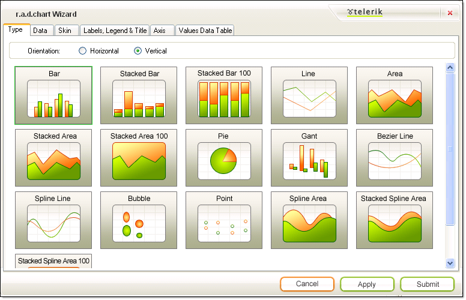

# The Wizard Type Tab

>caution **RadChart** has been deprecated since Q3 2014 and is no longer recommended for use, as it does not support modern browsers. We strongly recommend using [RadHtmlChart](https://www.telerik.com/products/aspnet-ajax/html-chart.aspx), Telerik's modern client-side charting component. 
>To transition from RadChart to RadHtmlChart, refer to the following migration articles:
> - [Migrating Series]()
> - [Migrating Axes]()
> - [Migrating Date Axes]()
> - [Migrating Databinding]()
> - [Features parity]()
>Explore the [RadHtmlChart documentation]() and online demos to determine how it fits your development needs.

The Type tab lets you quickly choose the chart type by providing visual cues to what each type looks like. Here you can also choose the chart orientation.

