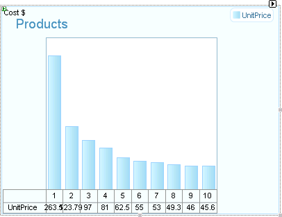
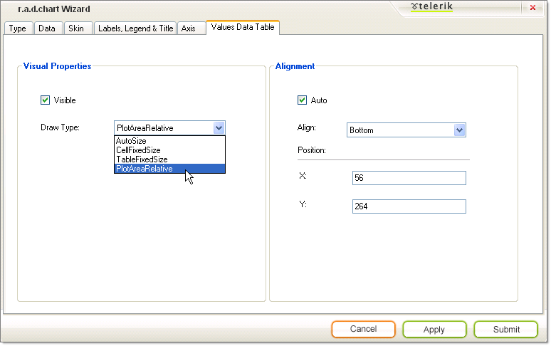

# Understanding Wizard Values Data Table Tab

>caution  __RadChart__ has been replaced by[RadHtmlChart](http://www.telerik.com/products/aspnet-ajax/html-chart.aspx), Telerik's client-side charting component.	If you are considering __RadChart__ for new development, examine the[RadHtmlChart documentation](ffd58685-7423-4c50-9554-f92c70a75138)and[online demos](http://demos.telerik.com/aspnet-ajax/htmlchart/examples/overview/defaultcs.aspx)first to see if it will fit your development needs.	If you are already using __RadChart__ in your projects, you can migrate to __RadHtmlChart__ by following these articles:[Migrating Series](2f393f28-bc31-459c-92aa-c3599785f6cc),[Migrating Axes](3f1bea81-87b9-4324-b0d2-d13131031048),[Migrating Date Axes](93226130-bc3c-4c53-862a-f9e17b2eb7dd),[Migrating Databinding](d6c5e2f1-280c-4fb0-b5b0-2f507697511d),[Feature parity](010dc716-ce38-480b-9157-572e0f140169).	Support for __RadChart__ is discontinued as of __Q3 2014__ , but the control will remain in the assembly so it can still be used.	We encourage you to use __RadHtmlChart__ for new development.
>

The __Values Data Table__tab of the Wizard controls the general look and positioning of the [chart data table]().
>caption 

## Visual Properties

* Check __Visible__to display the chart data table.By default this is unchecked.

* Select Draw Type from the drop down list to control the general size and positioning of the chart.Select __AutoSize__ to have each cell size to the data inside of it.__PlotAreaRelative__ places each cell just below the chart series item it represents. __CellFixedSize__and __TableFixedSize__fix the size of the cells or table irrespective of the data it contains.

## Alignment

Use the __Align__drop down list to place the chart data table in a predefined position (e.g. Top, Bottom, BottomRight, etc.)To place the data table at exact coordinates, uncheck __Auto__ and enter values for __X__and __Y__.
>caption 

