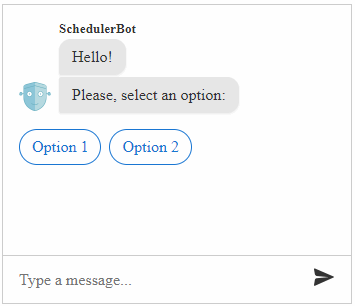

# Default Actions

The **RadChat** control has a support for default **suggested actions** which are rendered inside a Suggested Actions Pane. A **Suggested Action** is a button that the user can tap/click to provide input. That is why they can be also called **Quick Actions**.

Unlike buttons that appear within [rich cards]() (which remain visible and accessible to the user even after being tapped), buttons that appear within the suggested actions pane will disappear after the user makes a selection. This prevents the user from tapping stale buttons within a conversation and simplifies bot development (since you will not need to account for that scenario). 

To display the **suggestedActions** propmt, you need to call  the `renderSuggestedActions` method of the control.

Once the user clicks on an option, the [OnActionClick]() event is fired and the [OnPost]() event.

>caption **Figure 1**: A Chat with suggested actions.



````ASPX
<telerik:RadChat runat="server" ID="RadChat1" Width="350px" Height="300px">
    <ClientEvents OnLoad="OnLoad" OnActionClick="OnActionClick" />
</telerik:RadChat>
 ````

````JavaScript
var chatBot = { id: 1, name: "SchedulerBot", iconUrl: "avatar.png" };

function OnLoad(sender) {
    var chat = sender;

    chat.renderMessage({ text: "Hello!" }, chatBot);
    chat.renderMessage({ text: "Please, select an option:" }, chatBot);
    
    chat.renderSuggestedActions([{
        title: "Option 1",
        value: "Value 1"
    }, {
        title: "Option 2",
        value: "Value 2"
    }], chatBot);
}

function OnActionClick(sender, args) {
    var optionValue = args.get_text();
    // setTimeout needed so that the message is rendered after the clicked option is rendered
    setTimeout(function () {
        sender.renderMessage({ text: 'You have selected "' + optionValue + '"' }, chatBot);
    });
}
````


# See Also

 * [RadChat Structure]()

 * [RadChat Client-Side Programming]()

 * [RadChat Client-Side Events]()

 * [RadChat Server-Side Programming]()

 * [RadChat Online Demos](https://demos.telerik.com/aspnet-ajax/chat/overview/defaultcs.aspx)

 
