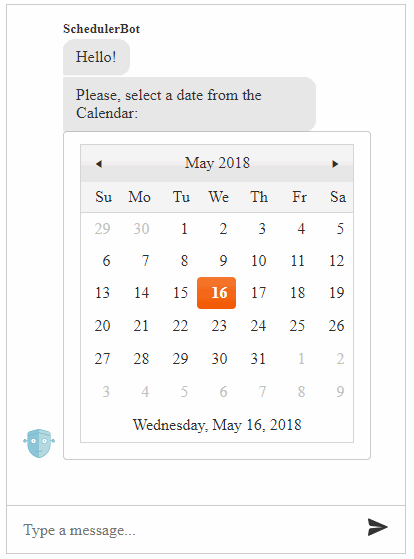

# Custom Components


The **RadChat** control supports the implementation of custom components which allows you to use JavaScript to render any content in the chat flow. For example, you can use the [Kendo UI Calendar](https://docs.telerik.com/kendo-ui/controls/scheduling/calendar/overview) widget to facilitate the user to choose a date.

To use the custom components you should first register them via the `kendo.chat.registerComponent(componentName, component);` method and then set the component name as a value to the `contentType` property of the attachment. Below you can find a sample implementaction of a CalendarComponent and how to use it.

>caption **Figure 1**: A Chat renders a Kendo UI Calendar to facilitate date choosing.



````HTML
 <%-- load Kendo UI styles needed for the Kendo UI Calendar --%>
<link rel="stylesheet" href="~/styles/kendo.common.min.css" />
<link rel="stylesheet" href="~/styles/kendo.default.min.css" />
<style>
    html .t-card {
        max-width: none;
    }
</style>
````

````ASP.NET
<telerik:RadScriptManager ID="RadScriptManager1" runat="server">
    <Scripts>
        <asp:ScriptReference Assembly="Telerik.Web.UI" Name="Telerik.Web.UI.Common.Core.js" />
        <asp:ScriptReference Assembly="Telerik.Web.UI" Name="Telerik.Web.UI.Common.jQuery.js" />
        <asp:ScriptReference Assembly="Telerik.Web.UI" Name="Telerik.Web.UI.Common.jQueryInclude.js" />
    </Scripts>
</telerik:RadScriptManager>
````

````HTML
 <%-- load Kendo UI scripts needed for the Kendo UI Calendar after the ScriptManager and before RadChat --%>
<script src="~/scripts/kendo.all.min.js"></script>
````

````ASP.NET
<telerik:RadChat runat="server" ID="RadChat1" Width="400px" Height="550px">
    <ClientEvents OnLoad="OnLoad" />
</telerik:RadChat>
 ````

````JavaScript
function OnLoad(sender) {
    var chat = sender;

    chat.postMessage("Hello!");
    chat.postMessage("Please, select a date from the Calendar.");

    chat.renderAttachments({
        attachments: [{
            contentType: "CalendarComponent",
            content: {
                value: new Date()
            }
        }]
    }, chat.get_user());
}
````

````JavaScript
// register the CalendarComponent containing the Kendo UI Calendar widget
var CalendarComponent = kendo.chat.Component.extend({
    init: function (options, view) {
        kendo.chat.Component.fn.init.call(this, options, view);

        // Create a <div> from which the Calendar will be initialized
        var calendarElement = $('<div>');

        // Initialize the Calendar widget passing the provided value
        calendarElement.kendoCalendar({
            value: options.value,
            // Implement the logic to be executed
            // when the user selects a date
            change: function (e) {
                var chat = $telerik.$(this.element).closest(".RadChat")[0].control;
                chat.postMessage('You have selected ' + kendo.toString(e.sender.value(), 'D') + '!');

                var element = e.sender.element.closest('.t-card-container');

                setTimeout(function () {
                    e.sender.destroy();
                    element.remove();
                });
            }
        });

        // Place the calendar within the Chat Card
        var bodyElement = $('<div>').addClass("t-card-body").append(calendarElement);
        this.element.addClass("t-card").append(bodyElement);
    }
});

kendo.chat.registerComponent("CalendarComponent", CalendarComponent);
````


# See Also

 * [RadChat Structure]()

 * [RadChat Server-Side Programming]()

 * [RadChat Client-Side Programming]()

 * [RadChat Online Demos](https://demos.telerik.com/aspnet-ajax/chat/overview/defaultcs.aspx)

 