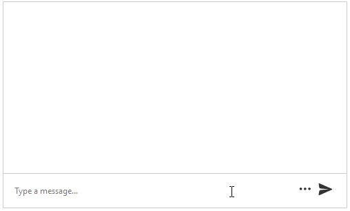
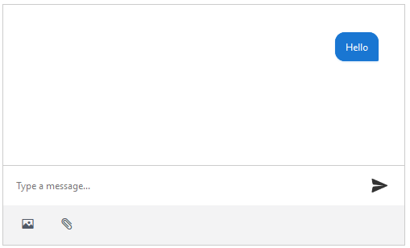

# Chat Toolbar


The toolbar of **RadChat** control allows you to add toolbar actions for achieving more user-friendly conversational UI. 

The toolbar is located below the input box of the Chat. You can display or hide the toolbar by clicking the toolbar icon which is placed to the left of the Send button. The **RadChat** toolbar enables you to add buttons for end-user interaction. Depending on the executed command in the toolbar, you can also implement a specific functionality by handling the [toolClick]() event of the control.

The following examples demonstrates how to add a custom action buttons to the toolbar of the **RadChat** and define the control's behavior. The image below is a result from **Example 2**:

>caption **Figure 2**: A Chat with expandable toolbar.


## Configure Toolbar Items

To configure the Toolbar items, use the composite `ButtonsCollection` property of the Chat.

>caption **Figure 1**: A Chat with toolbar buttons.



>caption **Example 1**: A Chat with toolbar buttons.

````ASPX
<style type="text/css">
    .t-i-image::before {content: "\e501";}
    .t-i-clip::before {content: "\e10e";}
</style>
<script type="text/javascript">
    function toolClick(sender, args) {
        var commandName = args.get_name();
        alert("You clicked the " + commandName + " button.")
    }
</script>
<telerik:RadChat runat="server" ID="RadChat1" Skin="Default" Height="300px">
    <ToolbarSettings>
        <ButtonsCollection>
            <telerik:ChatToolbarButton Text="Add image" Name="AddImage" IconClass="t-icon t-i-image" />
            <telerik:ChatToolbarButton Text="Add file" Name="AddFile" IconClass="t-icon t-i-clip" />
        </ButtonsCollection>
    </ToolbarSettings>
    <ClientEvents OnToolClick="toolClick" />
</telerik:RadChat>
 ````


## Configure Toolbar Behavior

The Chat configuration object allows you to configure the following behavior aspects of the toolbar:

- `AnimationSettings` - The [animation](https://docs.telerik.com/kendo-ui/api/javascript/ui/chat/configuration/toolbar.animation) behavior of its toolbar.
- `Scrollable` - defines whether the toolbar will be [scrollable](https://docs.telerik.com/kendo-ui/api/javascript/ui/chat/configuration/toolbar.scrollable). A scrollbar is useful when the buttons cannot entirely fit within the width of RadChat.
- `Toggleable` - Whether the toolbar will be [displayed or hidden](https://docs.telerik.com/kendo-ui/api/javascript/ui/chat/configuration/toolbar.toggleable) upon a button click.


>caption **Example 2**: A Chat with a expandable toolbar.

````ASPX
<style type="text/css">
    .t-i-image::before {content: "\e501";}
    .t-i-clip::before {content: "\e10e";}
</style>
<telerik:RadChat runat="server" ID="RadChat1" Skin="Default" Height="300px">
    <ToolbarSettings Toggleable="true" Scrollable="true">
        <ButtonsCollection>
            <telerik:ChatToolbarButton Text="Add image" Name="AddImage" IconClass="t-icon t-i-image" />
            <telerik:ChatToolbarButton Text="Add file" Name="AddFile" IconClass="t-icon t-i-clip" />
            <telerik:ChatToolbarButton Text="Add image 1" Name="AddImage1" IconClass="t-icon t-i-image" />
            <telerik:ChatToolbarButton Text="Add file 1" Name="AddFile1" IconClass="t-icon t-i-clip" />
            <telerik:ChatToolbarButton Text="Add image 2" Name="AddImage2" IconClass="t-icon t-i-image" />
            <telerik:ChatToolbarButton Text="Add file 2" Name="AddFile2" IconClass="t-icon t-i-clip" />
            <telerik:ChatToolbarButton Text="Add image 3" Name="AddImage3" IconClass="t-icon t-i-image" />
            <telerik:ChatToolbarButton Text="Add file 3" Name="AddFile3" IconClass="t-icon t-i-clip" />
            <telerik:ChatToolbarButton Text="Add image 4" Name="AddImage4" IconClass="t-icon t-i-image" />
            <telerik:ChatToolbarButton Text="Add file 4" Name="AddFile4" IconClass="t-icon t-i-clip" />
            <telerik:ChatToolbarButton Text="Add image 5" Name="AddImage5" IconClass="t-icon t-i-image" />
            <telerik:ChatToolbarButton Text="Add file 5" Name="AddFile5" IconClass="t-icon t-i-clip" />
        </ButtonsCollection>
        <AnimationSettings>
            <CollapseSettings Duration="500" Effects="expandVertical fadeIn" />
            <ExpandSettings Duration="500" Effects="expandVertical fadeIn" />
        </AnimationSettings>
    </ToolbarSettings>
</telerik:RadChat>
 ````


# See Also

 * [RadChat Structure]()

 * [RadChat Server-Side Programming]()

 * [RadChat Client-Side Programming]()

 * [Kendo UI Toolbar](https://docs.telerik.com/kendo-ui/controls/conversational-ui/chat/toolbar)

 * [RadChat Online Demos](http://demos.telerik.com/aspnet-ajax/chat/overview/defaultcs.aspx)
 