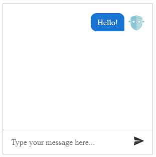

# Getting Started

The following tutorial demonstrates how you can add a simple **RadChat** control. The end result will be similar to **Figure 1**:

>caption **Figure 1**: A RadChat configuration with a few shapes and connections



1. Add a **ScriptManager** control on a Web Form.

1. Add a **RadChat** control on this Web Form: 
	
	>caption **Example 1**: Declaration of a **RadChat** control.

	````ASPX
    <asp:ScriptManager runat="server" ID="ScriptManager1"  />
    <telerik:RadChat ID="RadChat1" runat="server">
    </telerik:RadChat>
    ````


1. Set some of the messages and user settings like **Placeholder**, **Name** and **IconUrl**.

	>caption **Example 2**: The chat now has a custom placeholder message, username and avatar

	````ASPX
    <asp:ScriptManager runat="server" ID="ScriptManager1"  />
    <telerik:RadChat runat="server" ID="RadChat1">
        <MessagesSettings Placeholder="Type your message here..." />
        <UserSettings Name="John" IconUrl="avatar.png" />
    </telerik:RadChat>
    ````

1. Press F5 to run the application. You will see the chat that is displayed in **Figure 1**. From this point you can start interacting with the chat.

	>caption **Example 3**: Assigning the client-side event handlers:
	
    ````ASPX
    <asp:ScriptManager runat="server" ID="ScriptManager1"  />
    <telerik:RadChat runat="server" ID="RadChat1" Width="300px" Height="300px">
        <ClientEvents
            OnActionClick="OnActionClick"
            OnInitialize="OnInitialize"
            OnLoad="OnLoad"
            OnPost="OnPost"
            OnSendMessage="OnSendMessage"
            OnTypingEnd="OnTypingEnd"
            OnTypingStart="OnTypingStart" />
        <MessagesSettings Placeholder="Type your message here..." />
        <UserSettings Name="John" IconUrl="avatar.png" />
    </telerik:RadChat>
    ````

    ````JavaScript
    function OnActionClick(sender, args) {    
    }
    
    function OnInitialize(sender, args) {    
    }
    
    function OnLoad(sender) {
        sender.postMessage("Hello!");
    }
    
    function OnPost(sender) {    
    }
    
    function OnSendMessage(sender, args) {    
    }
    
    function OnTypingEnd(sender, args) {    
    }
    
    function OnTypingStart(sender, args) {    
    }
    ````


# See Also

 * [RadChat Structure]()

 * [RadChat Client-Side Programming]()
 
 * [RadChat Server-Side Programming]()

 * [Connecting to a Chatbot Service]() 

 
