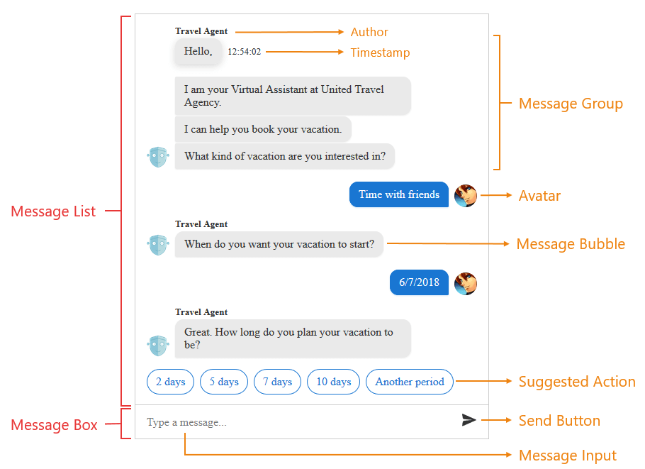

# Structure Overview

>caption **Figure 1**: A chat structure.

The two main elements the **RadChat** control is built with are **Message List** and **Message Box**.

## The Message List can contain: 

* **Message Bubble** - element containing a message string. Usually the current user's message bubbles are right aligned and other users/chatbots' message bubbles are left aligned.
* **Message Group** - a continuous series of message bubbles by the same user. 
* **Avatar** - a user icon next to the message bubble indicating the sender of the message. If there are more than one continuous messages from the same user, the icon stands only next to the last message of the message group.
* **Author** - a text message indicating the author of the message, if such is available. Displayed over the first message bubble of a message group.
* **Message Timestamp** - date string near the message bubble showing the time when the message is sent. Clicking the message bubble toggles the timestamp visibility.
* **Suggested Action** - button that the user can tap/click to provide input. Unlike buttons that appear within rich cards (which remain visible and accessible to the user even after being tapped), buttons that appear within the suggested actions pane will disappear after the user makes a selection. This prevents the user from tapping stale buttons within a conversation and simplifies bot development (since you will not need to account for that scenario).
* **Suggested Actions Pane** - an element that contains one or more suggested action elements.
* **Rich Card Attachment** - complex messages that can contain more that just a message string. For example, every card can contain image, custom styling and suggested actions. The default card available in **RadChat** is a "heroCard". More on cards can be found in the [Custom Templates]() article.  
* **Deck of cards** - collection of rich cards that can be listed in two ways: 
    * **Carousel** - displays multiple cards *horizontally*. Might be referred as **Card Deck**;
    * **List** - displays multiple cards *vertically*. Might be referred as **Card List**; 

## The Message Box contains:

* **Message Input** - input where the user writes their message. When there is no message written, a placeholder message is visible.
* **Send Button** - button that when clicked sends the message in the message input. When the focus is on the message input, pressing the `Enter` key is the same as clicking the send button.

# See Also

 * [RadChat Overview]()

 * [RadChat Server-Side Programming]()
 
