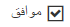

# Right-to-Left Support

The **RadCheckBox** fully supports right-to-left (RTL) language locales (**Figure 1**). In order to turn on the RTL support, you should set **dir=rtl to the html or body** element or at least to its parent element (**Figure 1**). You can also use the **direction:rtl** CSS property.

>caption Figure 1: RadCheckBox in RTL mode.



>caption Example 1: Set the "direction: rtl" style to the **RadCheckBox**'s wrapper element in order to enable the RTL support for the control.

````ASP.NET
<div style="direction: rtl;">
	<telerik:RadCheckBox ID="RadCheckBox1" runat="server" Text="موافق" Checked="true">
	</telerik:RadCheckBox>
</div>
````

## See Also

 * [Live Demo: RadCheckBox RTL Support](https://demos.telerik.com/aspnet-ajax/checkbox/examples/righttoleft/defaultcs.aspx)

 * [WCAG 2.0 and Section 508 Accessibility Compliance]()

 * [Keyboard Support]()
