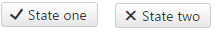

# CheckBox Overview

The **RadCheckBox** control (**Figure 1**) enriches the features, that ASP.NET CheckBox control has. Additionally, it provides events, supports Commands and numerous [themes](). 

The control can be easily styled by changing the **Skin** property. This will eliminate the need to use the [RadFormDecorator](), just to style a single checkbox. Developers can easily migrate their applications from using the standard ASP.NET (checkbox) controls to the new **RadCheckBox** control, because most of their functionality is provided by our control, and is controlled by the same or similar (intuitive) properties.


>caption Figure 1: RadCheckBox configuration.



>caption Example 1: A basic example of a RadCheckBox setup.

````ASP.NET
<telerik:RadCheckBox ID="RadCheckBox1" runat="server" Text="I agree to the Terms of Service"></telerik:RadCheckBox>
````

>note **RadCheckBox** does not support a Classic [render mode](). Setting its RenderMode to Classic will default to the Lightweight render mode.

## See Also

 * [RadCheckBox Online Demos](http://demos.telerik.com/aspnet-ajax/checkbox/examples/overview/defaultcs.aspx)
 
 * [RadCheckBox Getting Started]()
 
 * [RadCheckBox Select State]()
 
 * [RadCheckBox Properties and Events]()
 