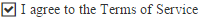

# CheckBox Overview

The **RadCheckBox** control (**Figure 1**) enriches the features, that ASP.NET CheckBox control has. Additionally, it provides events, supports Commands and numerous [themes](). **RadCheckBox** is available as of **Q1 2016**.

The control can be easily styled by changing the `Skin` property. This will eliminate the need to use the [RadFormDecorator](), just to style a single checkbox. Developers can easily migrate their applications from using the standard ASP.NET (checkbox) controls to the **RadCheckBox** control, because most of their functionality is provided by our control, and is controlled by the same or similar (intuitive) properties.


>caption Figure 1: RadCheckBox configuration.



>caption Example 1: A basic example of a RadCheckBox setup.

````ASP.NET
<telerik:RadCheckBox ID="RadCheckBox1" runat="server" Text="I agree to the Terms of Service"></telerik:RadCheckBox>
````

>note The default value of the `AutoPostBack` property is `true`, which means RadCheckBox will POST the page to the server when checked/unchecked.

>note **RadCheckBox** does not support a Classic [render mode](). Setting its RenderMode to Classic will default to the Lightweight render mode.

## See Also

 * [RadCheckBox Online Demos](https://demos.telerik.com/aspnet-ajax/checkbox/examples/overview/defaultcs.aspx)

 * [RadCheckBox Getting Started]()

 * [RadCheckBox Checked State]()

 * [RadCheckBox Properties and Events]()
