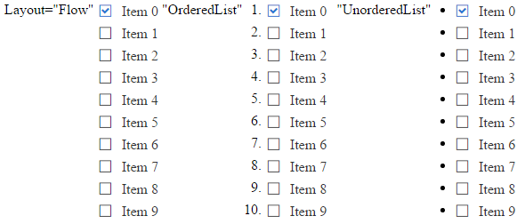

# Overview

This help article showcases how to configure the layout of the **RadCheckBoxList** control via the `Layout`, `Columns` and `Direction` properties.

* [Layout](#layout)

* [Columns](#columns)

* [Direction](#direction)

## Layout

You can control whether the checkbox buttons will be rendered inside ul or li elements or without any elements. This behavior is controlled via the `Layout` property that takes `Flow` (default value), `OrderedList` and `UnorderedList` values.

You can see the output of **Example 1** that shows different layouts of the control in **Figure 1**.

>caption Example 1: Configure the Layout of RadCheckBoxList. 

````ASP.NET
Layout="Flow"
<telerik:RadCheckBoxList ID="RadCheckBoxList1" runat="server" Layout="Flow">
</telerik:RadCheckBoxList>
"OrderedList"
<telerik:RadCheckBoxList ID="RadCheckBoxList2" runat="server" Layout="OrderedList">
</telerik:RadCheckBoxList>
"UnorderedList"
<telerik:RadCheckBoxList ID="RadCheckBoxList3" runat="server" Layout="UnorderedList">
</telerik:RadCheckBoxList>
````
````C#
protected void Page_Init(object sender, EventArgs e)
{
	for (int i = 0; i < 10; i++)
	{
		CheckBoxListItem rbli = new CheckBoxListItem() { Text = "Item " + i, Value = i.ToString() };
		if (i == 0) { rbli.Selected = true; }
		RadCheckBoxList1.Items.Add(rbli);
		RadCheckBoxList2.Items.Add(rbli);
		RadCheckBoxList3.Items.Add(rbli);
	}
}
````
````VB
Protected Sub Page_Init(sender As Object, e As EventArgs)
	For i As Integer = 0 To 9
		Dim rbli As New CheckBoxListItem() With { _
			Key .Text = "Item " & i, _
			Key .Value = i.ToString() _
		}
		If i = 0 Then
			rbli.Selected = True
		End If
		RadCheckBoxList1.Items.Add(rbli)
		RadCheckBoxList2.Items.Add(rbli)
		RadCheckBoxList3.Items.Add(rbli)
	Next
End Sub
````

>caption Figure 1: Compare different layouts of RadCheckBoxList.

 

## Columns

Checkbox buttons inside the **RadCheckBoxList** are rendered inside a single column by default. You can change this behavior using the `Columns` property. You can see a sample in **Example 2** and the output in **Figure 2**.

>caption Example 2: The code that shows how to display checkbox buttons in two columns. 

````ASP.NET
<telerik:RadCheckBoxList ID="RadCheckBoxList1" runat="server" Layout="Flow" Columns="2">
</telerik:RadCheckBoxList>
````
````C#
protected void Page_Init(object sender, EventArgs e)
{
	for (int i = 0; i < 10; i++)
	{
		CheckBoxListItem rbli = new CheckBoxListItem() { Text = "Item " + i, Value = i.ToString() };
		if (i == 0) { rbli.Selected = true; }
		RadCheckBoxList1.Items.Add(rbli);
	}
}
````
````VB
Protected Sub Page_Init(sender As Object, e As EventArgs)
	For i As Integer = 0 To 9
		Dim rbli As New CheckBoxListItem() With { _
			Key .Text = "Item " & i, _
			Key .Value = i.ToString() _
		}
		If i = 0 Then
			rbli.Selected = True
		End If
		RadCheckBoxList1.Items.Add(rbli)
	Next
End Sub
````

>caption Figure 2: Display checkbox buttons in two columns.

 

## Direction

You can control the direction in which checkbox buttons are displayed within the groups via the `Direction` property (the output of **Example 3** is shown in **Figure 3**).

>caption Example 3: Configure horizontal and vertical direction for checkbox buttons. 

````ASP.NET
Direction="Horizontal"
<telerik:RadCheckBoxList ID="RadCheckBoxList1" runat="server" Layout="Flow" Columns="2" Direction="Horizontal">
</telerik:RadCheckBoxList>
Direction="Vertical"
<telerik:RadCheckBoxList ID="RadCheckBoxList2" runat="server" Layout="Flow" Columns="2" Direction="Vertical">
</telerik:RadCheckBoxList>
```` 
````C#
protected void Page_Init(object sender, EventArgs e)
{
	for (int i = 0; i < 10; i++)
	{
		CheckBoxListItem rbli = new CheckBoxListItem() { Text = "Item " + i, Value = i.ToString() };
		if (i == 0) { rbli.Selected = true; }
		RadCheckBoxList1.Items.Add(rbli);
		RadCheckBoxList2.Items.Add(rbli);
	}
}
````
````VB
Protected Sub Page_Init(sender As Object, e As EventArgs)
	For i As Integer = 0 To 9
		Dim rbli As New CheckBoxListItem() With { _
			Key .Text = "Item " & i, _
			Key .Value = i.ToString() _
		}
		If i = 0 Then
			rbli.Selected = True
		End If
		RadCheckBoxList1.Items.Add(rbli)
		RadCheckBoxList2.Items.Add(rbli)
	Next
End Sub
````

>caption Figure 3: Display checkbox buttons in different direction within the columns.

 

## See Also
 
 * [Getting Started]()

 * [Server-Side API]()
 
 * [Client-Side API]()
