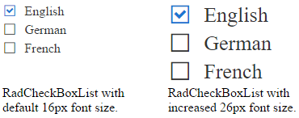

# Elastic Design

This article explains the **elastic design capabilities RadCheckBoxList offers**. **Example 1** shows the basic approach to scale the control by only changing its default font size.

@[template](/_templates/common/render-mode.md#resp-design-desc "slug-el: no, slug-fl: no")

@[template](/_templates/common/font-size-notes.md#note-and-example-no-ver "control: RadCheckBoxList")

>caption Figure 1: Comparison between appearance of a RadCheckBoxList with regular font size and with increased font size.



>caption Example 2: Shows how to increase the font size of a RadCheckBoxList in Figure 1.

````CSS
<style type="text/css">
	.RadCheckBoxList button {
		font-size: 26px;
	}
</style>
````

````ASP.NET
<telerik:RadCheckBoxList runat="server" ID="RadCheckBoxList1">
	<Items>
        <telerik:CheckBoxListItem Text="English" Selected="true" />
        <telerik:CheckBoxListItem Text="German" />
        <telerik:CheckBoxListItem Text="French" />
    </Items>
</telerik:RadCheckBoxList>
````

## See Also

 * [Mobile Support Overview]()

 * [Render Modes]()

@[template](/_templates/common/font-size-notes.md#related-resources)