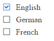

# RadCheckBoxList Overview

The **RadCheckBoxList** control (**Figure 1**) enriches the features of the ASP.NET CheckBoxList control. Additionally, it provides events, supports Commands and numerous [themes](). **RadCheckBoxList** is available as of **R3 2016**.

You can easily style the control by changing the `Skin` property. This will eliminate the need to use the [RadFormDecorator](). Developers can easily migrate their applications from using the standard ASP.NET (CheckBoxList) controls to the **RadCheckBoxList** control, because most of the CheckBoxList's functionality is provided by the **RadCheckBoxList** control, and the **RadCheckBoxList** is controlled by the same or similar (intuitive) properties.


>caption Figure 1: RadCheckBoxList configuration.



>caption Example 1: A basic example of a RadCheckBoxList setup.

````ASP.NET
<telerik:RadCheckBoxList runat="server" ID="RadCheckBoxList1">
    <Items>
        <telerik:CheckBoxListItem Text="English" Selected="true" />
        <telerik:CheckBoxListItem Text="German" />
        <telerik:CheckBoxListItem Text="French" />
    </Items>
</telerik:RadCheckBoxList>
````

>note **RadCheckBoxList** does not support Classic [render mode](). Setting its RenderMode to Classic will default to the Lightweight render mode.

## See Also

 * [RadCheckBoxList Online Demos](http://demos.telerik.com/aspnet-ajax/checkboxlist/examples/overview/defaultcs.aspx)
 
 * [RadCheckBoxList Getting Started]()
 
 * [RadCheckBoxList Properties and Events]()
 
