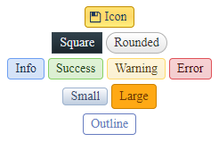
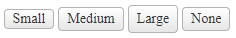
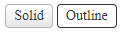
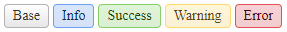
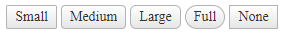
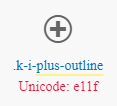
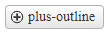
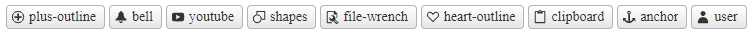

# Appearance

The Chip provides predefined appearance options such as different sizes, border radiuses, fill modes and theme colors.



For a live example, visit the [Appearance Demo of the Chip](https://demos.telerik.com/aspnet-ajax/chip/appearance/defaultcs.aspx).

## Options

The Telerik WebForms Chip supports the following styling options:

- [`Size`](#size)—Configures the overall size of the component.
- [`ThemeColor`](#themecolor)—Configures what color will be applied to the component.
- [`FillMode`](#fillmode)—Configures how the color is applied to the component.
- [`Rounded`](#rounded)—Configures the border radius of the component.
- [`Icon`](#icon)—Displays an icon.

## Size

The size option controls how big or small the rendered chip looks.



The following values are available for the `size` option:

- `Small`
- `Medium` (default)
- `Large`
- `None` - The chip will naturally resize based on the content


Example

````ASP.NET
<telerik:RadChip runat="server" Size="Small" Label="Small"></telerik:RadChip>
<telerik:RadChip runat="server" Size="Medium" Label="Medium"></telerik:RadChip>
<telerik:RadChip runat="server" Size="Large" Label="Large"></telerik:RadChip>
<telerik:RadChip runat="server" Size="None" Label="None"></telerik:RadChip>
````

## FillMode

The `FillMode` option controls the way the color is applied to the rendered div.



The following values are available for the `FillMode` option:

- `Solid` (default)
- `Outline`

Example

````ASP.NET
<telerik:RadChip runat="server" FillMode="Solid" Label="Solid"></telerik:RadChip>
<telerik:RadChip runat="server" FillMode="Outline" Label="Outline"></telerik:RadChip>
````

## ThemeColor

The `ThemeColor` option controls the color that will be applied to the rendered Chip.



The following values are available for the `ThemeColor` option:

- `Base` (default)
- `Info`
- `Success`
- `Warning`
- `Error`

Example

````ASP.NET
<telerik:RadChip runat="server" ThemeColor="Base" Label="Base"></telerik:RadChip>
<telerik:RadChip runat="server" ThemeColor="Info" Label="Info"></telerik:RadChip>
<telerik:RadChip runat="server" ThemeColor="Success" Label="Success"></telerik:RadChip>
<telerik:RadChip runat="server" ThemeColor="Warning" Label="Warning"></telerik:RadChip>
<telerik:RadChip runat="server" ThemeColor="Error" Label="Error"></telerik:RadChip>
````

## Rounded

The `Rounded` option controls how much border radius is applied to the rendered Chip.



The following values are available for the `Rounded` option:

- `Small`
- `Medium` (default)
- `Large`
- `Full`
- `None`

Example

````ASP.NET
<telerik:RadChip runat="server" Rounded="Small" Label="Small"></telerik:RadChip>
<telerik:RadChip runat="server" Rounded="Medium" Label="Medium"></telerik:RadChip>
<telerik:RadChip runat="server" Rounded="Large" Label="Large"></telerik:RadChip>
<telerik:RadChip runat="server" Rounded="Full" Label="Full"></telerik:RadChip>
<telerik:RadChip runat="server" Rounded="None" Label="None"></telerik:RadChip>
````

## Icon

To enable icons for the chip, set the `Icon` property to the **name** of the embedded icon. 

Visit the [Web Font Icons - List of Font Icons](https://docs.telerik.com/kendo-ui/styles-and-layout/sass-themes/font-icons#list-of-font-icons) page and find the icon of your choice then copy its name without the `.k-i-` prefix. 

For example, if the icon is called `.k-i-plus-outline` the name would be `plus-outline`.



Example



Code 

````ASP.NET
<telerik:RadChip runat="server" Icon="plus-outline" Label="plus-outline"></telerik:RadChip>
````

More examples



Code 

````ASP.NET
<telerik:RadChip runat="server" Icon="plus-outline" Label="plus-outline"></telerik:RadChip>
<telerik:RadChip runat="server" Icon="bell" Label="bell"></telerik:RadChip>
<telerik:RadChip runat="server" Icon="youtube" Label="youtube"></telerik:RadChip>
<telerik:RadChip runat="server" Icon="shapes" Label="shapes"></telerik:RadChip>
<telerik:RadChip runat="server" Icon="file-wrench" Label="file-wrench"></telerik:RadChip>
<telerik:RadChip runat="server" Icon="heart-outline" Label="heart-outline"></telerik:RadChip>
<telerik:RadChip runat="server" Icon="clipboard" Label="clipboard"></telerik:RadChip>
<telerik:RadChip runat="server" Icon="anchor" Label="anchor"></telerik:RadChip>
<telerik:RadChip runat="server" Icon="user" Label="user"></telerik:RadChip>
````
 
## Next Steps

- [Customize the Chip]()
- [Client-side Programming]()
- [Server-side Programming]()

## See Also

- [Overview]()
- [Getting Started with the Telerik WebForms Chip]()
- [Customize the Chip]()
- [Client-side Programming]()
- [Server-side Programming]()
 