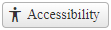
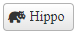
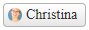

# Customization

The Chip component provides options for customizing its look and feel.

- [Custom Icons](#custom-icons)
- [Display Avatars](#display-avatars)

## Custom Icons



The Chip already implements a large set of icons by default (see [List of Font Icons](https://docs.telerik.com/kendo-ui/styles-and-layout/sass-themes/font-icons#list-of-font-icons)), but you can supply your own icons if you want. You can create the icons or use 3rd party Icon libraries such as Font Awesome.

### Create your custom icon CSS class

Telerik Assemblies load an icon font that contains a large set of icons. To use these icons, you will need to create CSS classes that point to the icon by their `Unicode`.

To create an icon class with the icons from the Telerik embedded fonts, you will need to:

- Create a Custom CSS class and set the `font-size`, `font-family` properties.
- Set the `content` property of the `::before` pseudo selector to the icon's Unicode. For the sake of demonstration, we used the `accessibility` icon from the **WebComponentsIcons** library ([List of Font Icons](https://docs.telerik.com/kendo-ui/styles-and-layout/sass-themes/font-icons#list-of-font-icons)).
- Point the `IconClass` property of the Chip component to the newly created CSS icon class

Example

````ASP.NET
<style>
    .myCustomIcon {
        font-family: "WebComponentsIcons";
        font-size: 16px;
    }
    .myCustomIcon::before {
        content: "\e14f";
    }
</style>

<telerik:RadChip runat="server" ID="RadChip1" Label="Accessibility" IconClass="myCustomIcon"></telerik:RadChip>
````

In case you have your own icons, you can import/load the Icon library and use that Font instead.

````CSS
 @font-face {
    font-family: "Icon Library Name";
    src: url(url_to_the_icon/my-icons.woff);
}

.myCustomIcon {
    font-family: "Icon Library Name";
    font-size: 16px;
}
````

### Using 3rd party Icon Library



If you do have your own icons, you can use 3rd part libraries, such as Font Awesome. 

- Import the library provided by Font Awesome
- Point the `IconClass` property to the pre-defined CSS classes of the Font Awesome Library

Example

````ASP.NET
<link href="link-to-font-awesome/all.min.css" rel="stylesheet" />

<telerik:RadChip runat="server" ID="RadChip1" Label="Hippo" Size="Large" IconClass="fa-solid fa-hippo"></telerik:RadChip>
````


## Display Avatars



To display Avatars:

- Create the CSS class with a background image
- Assign the CSS class name to the `AvatarClass` property

Example

````ASP.NET
<style>
    .christina {
        background-image: url("https://demos.telerik.com/aspnet-ajax/Img/Northwind/Customers/Thumbs/BERGS.jpg");
    }
</style>

<telerik:RadChip runat="server" ID="RadChip1" Label="Christina" AvatarClass="christina" Size="Large"></telerik:RadChip>
````

>important To display an avatar, make sure there is no `Icon` defined, otherwise, the icon will be displayed instead.

## Next Steps

- [Client-side Programming]()
- [Server-side Programming]()

## See Also

- [Overview]()
- [Getting Started with the Telerik WebForms Chip]()
- [Change the Appearance]()
- [Client-side Programming]()
- [Server-side Programming]()
 