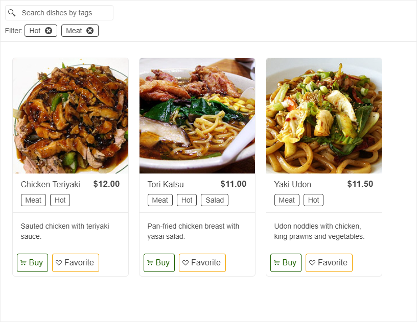

# Chip Overview

The Chip is a compact element that represents an input, attribute, or action. The component enables user input and verifies that input by converting text into chips.  

This component is a server-side, ASP.NET WebForms wrapper over the [Kendo UI Chip widget](https://docs.telerik.com/kendo-ui/controls/chip/overview).





The Chip UI component is versatile and can be used in various real-life scenarios across web and mobile applications. Here are some examples:

**In email apps**, Chip UI components can be used to manage recipient lists, where each chip represents a person, allowing for easy addition or removal.

**In social networking or job portals**, chips effectively showcase user skills or interests, offering a concise and interactive way to display and edit these attributes.

**E-commerce sites** employ chips for filtering products, enabling customers to visually manage selections like size, color, or brand.

To see the Chip in action, you can check out the live examples at [WebForms Chip demos](https://demos.telerik.com/aspnet-ajax/chip/overview/defaultcs.aspx).

## Functionality and Features

- [Appearance]() - The Chip delivers ready-to-use, predefined sets of styling options.
- [Customization]() - You can add custom icons to the Chip as well as display avatars in it.
 
## Next Steps

- [Getting Started with the Telerik WebForms Chip]()
- [Change the Appearance]()
- [Customize the Chip]()
- [Client-side Programming]()
- [Server-side Programming]()
 
## See Also

- [Getting Started with the Telerik WebForms Chip]()
- [Change the Appearance]()
- [Customize the Chip]()
- [Client-side Programming]()
- [Server-side Programming]()

 