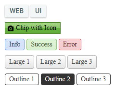
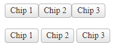
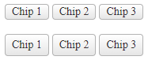
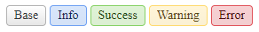
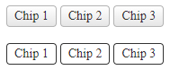
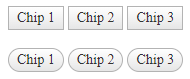
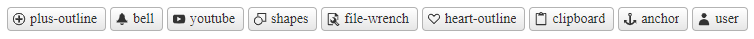
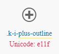

# Appearance

The ChipList provides predefined appearance options such as different sizes, border radiuses, fill modes and theme colors.



For a live example, visit the [Appearance Demo of the ChipList](https://demos.telerik.com/aspnet-ajax/chiplist/appearance/defaultcs.aspx).

## Options

The Telerik WebForms ChipList supports the following styling options:

- [`Size`](#size)—Configures the overall size of the component.
- [`ItemSize`](#themecolor)—Configures what color will be applied to the component.
- [`ThemeColor`](#themecolor)—Configures how the color is applied to the component.
- [`FillMode`](#fillmode)—Configures how the color is applied to the component.
- [`Rounded`](#rounded)—Configures the border radius of the component.
- [`Icon`](#icon)—Displays an icon.

## Size

Specifies the gap between the Chips in the ChipList.



The following values are available for the `Size` option:

- `Small`
- `Medium` (default)
- `Large`
- `None`—No gaps between the Chips


Example

````ASP.NET
<telerik:RadChipList ID="RadChipList1" runat="server" Size="None">
    <Items>
        <telerik:ChipListItem Label="Chip 1" />
        <telerik:ChipListItem Label="Chip 2" />
        <telerik:ChipListItem Label="Chip 3" />
    </Items>
</telerik:RadChipList>

<telerik:RadChipList ID="RadChipList2" runat="server" Size="Large">
    <Items>
        <telerik:ChipListItem Label="Chip 1" />
        <telerik:ChipListItem Label="Chip 2" />
        <telerik:ChipListItem Label="Chip 3" />
    </Items>
</telerik:RadChipList>
````

## ItemSize

The `ItemSize` option controls how big or small the rendered chip items look. 



The following values are available for the `ItemSize` option:

- `Small`
- `Medium` (default)
- `Large`
- `None`—The chip will naturally resize based on the content


Example

````ASP.NET
<telerik:RadChipList ID="RadChipList1" runat="server" ItemSize="Small">
    <Items>
        <telerik:ChipListItem Label="Chip 1" />
        <telerik:ChipListItem Label="Chip 2" />
        <telerik:ChipListItem Label="Chip 3" />
    </Items>
</telerik:RadChipList>

<telerik:RadChipList ID="RadChipList2" runat="server" ItemSize="Large">
    <Items>
        <telerik:ChipListItem Label="Chip 1" />
        <telerik:ChipListItem Label="Chip 2" />
        <telerik:ChipListItem Label="Chip 3" />
    </Items>
</telerik:RadChipList>
````

## ThemeColor

The `ThemeColor` option controls the color of the chips in the ChipList. This option is applied to the **ChipListItem**, therefore, each item can be individually colored.



The following values are available for the `ThemeColor` option:

- `Base` (default)
- `Info`
- `Success`
- `Warning`
- `Error`

Example

````ASP.NET
<telerik:RadChipList ID="RadChipList1" runat="server">
    <Items>
        <telerik:ChipListItem Label="Base" ThemeColor="Base" />
        <telerik:ChipListItem Label="Info" ThemeColor="Info" />
        <telerik:ChipListItem Label="Success" ThemeColor="Success" />
        <telerik:ChipListItem Label="Warning" ThemeColor="Warning" />
        <telerik:ChipListItem Label="Error" ThemeColor="Error" />
    </Items>
</telerik:RadChipList>
````

## FillMode

The `FillMode` specifies the background and border styles of the Chip items in the ChipList.



The following values are available for the `FillMode` option:

- `Solid` (default)
- `Outline`

Example

````ASP.NET
<telerik:RadChipList ID="RadChipList1" runat="server" FillMode="Solid">
    <Items>
        <telerik:ChipListItem Label="Chip 1" />
        <telerik:ChipListItem Label="Chip 2" />
        <telerik:ChipListItem Label="Chip 3" />
    </Items>
</telerik:RadChipList>

<telerik:RadChipList ID="RadChipList2" runat="server" FillMode="Outline">
    <Items>
        <telerik:ChipListItem Label="Chip 1" />
        <telerik:ChipListItem Label="Chip 2" />
        <telerik:ChipListItem Label="Chip 3" />
    </Items>
</telerik:RadChipList>
````

## Rounded

The `Rounded` option controls how much border radius is applied to the Chips inside the ChipList.



The following values are available for the `Rounded` option:

- `Small`
- `Medium` (default)
- `Large`
- `Full`
- `None`

Example

````ASP.NET
<telerik:RadChipList ID="RadChipList1" runat="server" Rounded="None">
    <Items>
        <telerik:ChipListItem Label="Chip 1" />
        <telerik:ChipListItem Label="Chip 2" />
        <telerik:ChipListItem Label="Chip 3" />
    </Items>
</telerik:RadChipList>

<telerik:RadChipList ID="RadChipList2" runat="server" Rounded="Full">
    <Items>
        <telerik:ChipListItem Label="Chip 1" />
        <telerik:ChipListItem Label="Chip 2" />
        <telerik:ChipListItem Label="Chip 3" />
    </Items>
</telerik:RadChipList>
````

## Icon

To enable icons for the items in the ChipList, set the `Icon` property to the **name** of the embedded icon. This option is applied to **ChipListItem**, therefore, each individual item can have its own icon.



Visit the [Web Font Icons - List of Font Icons](https://docs.telerik.com/kendo-ui/styles-and-layout/sass-themes/font-icons#list-of-font-icons) page and find the icon of your choice then copy its name without the `.k-i-` prefix. 

For example, if the icon is called `.k-i-plus-outline` the name would be `plus-outline`.



Example

````ASP.NET
<telerik:RadChipList ID="RadChipList1" runat="server">
    <Items>
        <telerik:ChipListItem runat="server" Icon="plus-outline" Label="plus-outline"></telerik:ChipListItem>
        <telerik:ChipListItem runat="server" Icon="bell" Label="bell"></telerik:ChipListItem>
        <telerik:ChipListItem runat="server" Icon="youtube" Label="youtube"></telerik:ChipListItem>
        <telerik:ChipListItem runat="server" Icon="shapes" Label="shapes"></telerik:ChipListItem>
        <telerik:ChipListItem runat="server" Icon="file-wrench" Label="file-wrench"></telerik:ChipListItem>
        <telerik:ChipListItem runat="server" Icon="heart-outline" Label="heart-outline"></telerik:ChipListItem>
        <telerik:ChipListItem runat="server" Icon="clipboard" Label="clipboard"></telerik:ChipListItem>
        <telerik:ChipListItem runat="server" Icon="anchor" Label="anchor"></telerik:ChipListItem>
        <telerik:ChipListItem runat="server" Icon="user" Label="user"></telerik:ChipListItem>
    </Items>
</telerik:RadChipList>
````

## Next Steps

- [Customize the ChipList]()
- [Enable Selection]()
- [Removable]()
- [Client-side Programming]()
- [Server-side Programming]()

## See Also

- [Overview]()
- [Getting Started with the ChipList]()
- [Customize the ChipList]()
- [Enable Selection]()
- [Removable]()
- [Client-side Programming]()
- [Server-side Programming]()
 
